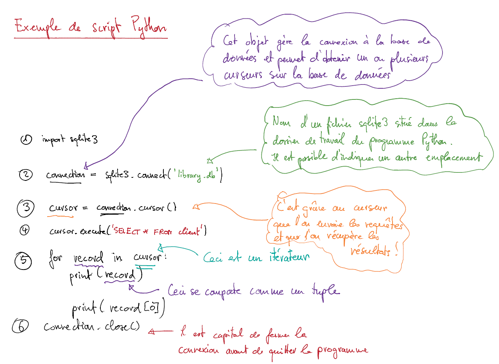

########################################
Accès à SQLite depuis Python : le DB-API
########################################

..  only:: html

    Vidéo d'introduction
    ====================

    Voici une petite vidéo introduisant les notions essentielles intervenant
    dans la communication d'un programme Python avec le SGBDR SQLite.

    ..  youtube::   w-1Moc0rpos
    

Résumé de la vidéo
==================

Pour accéder à une base de données SQLite, on utiliser le module ``sqlite3``
dont les principales méthodes sont présentées dans le script exemple de la
figure :ref:`fig-sqlite-api-theorie-template-python`.

..  _fig-sqlite-api-theorie-template-python:

    Programme type pour accéder au SGBDR SQLite

Programme type
==============

Voici un programme typique permettant d'adresser une requête SQL à SQLite :

..  code-block:: python
    :linenos:

    import sqlite3

    # Création de l'objet connexion
    connection = sqlite3.connect('library.db')

    # Création du curseur
    cursor = connection.cursor()

    # Le curseur permet d'envoyer des requêtes à SQLite et de récupérer les
    # résultats. Il faut toujours utiliser un bloc try / except, sans quoi le
    # programme pourrait se planter si le SGBDR n'est pas capable de répondre
    # à la requête
    try:
        cursor.execute("SELECT * FROM client")
    except sqlite3.OperationalError as e:
        print('Erreur dans la requête SQL : ' + str(e))

    # Traitement des données en parcourant le cursor
    for record in cursor:
        print(record)

    # Il faut appliquer les changements à la base de données si on a fait
    # des requêtes INSERT, UPDATE ou DELETE qui affectent la base de données
    connection.commit()

    # Fermeture de la connexion à la base de données
    connection.close()

Remarques
=========

Il faut bien observer les différentes étapes nécessaires pour accéder à la base de données

#)  Ouvrir une connexion à la base de données (ligne 4)

#)  Créer un curseur qui permettra d'envoyer des requêtes et de traiter les résultats (ligne 7)

#)  Envoyer une ou plusieurs requêtes SQL au SGBDR en veillant à gérer les
    exceptions telles que ``sqlite3.OperationalError`` (lignes 13-16)

#)  Parcourir le résultat renvoyé par le SGBDR à l'aide de l'itérateur que
    constitue le curseur ``cursor`` (lignes 19-20)

#)  Application définitive des changements à la base de données si l'on a 
    utilisé des requêtes ``INSERT``, ``UPDATE`` ou ``DELETE`` (ligne 24).

#)  Fermer la connexion à la base de données (ligne 27)

Récupérer des dictionnaires au lieu de simples tuples
=====================================================

Il peut être très pratique de recevoir des dictionnaires comme résultat de
requêtes ``SELECT`` au lieu d'obtenir des tuples. Ceci peut s'obtenir aisément
en affectant ``sqlite3.Row`` à l'attribut ``row_factory`` de l'objet connexion :

::

    connection = sqlite3.connect('library.db')
    connection.row_factory = sqlite3.Row

On peut ensuite traiter l'objet ``record`` comme un dictionnaire. Par exemple,
le code

::

    cursor = connection.cursor()
    for record in cursor.execute("SELECT * FROM client"):
        print(record['nom'], ' : ', record['client_id'])

va afficher les données suivantes : 

::

    Archambault  :  1
    Au plaisir de Lire  :  2
    Librairie du Nouveau Monde  :  3
    Librairie La Liberté  :  4
    Globe Trotteur  :  5
    Arts Lettres et Technique  :  6
    Camelot  :  7
    Livres et Jardins  :  8
    Librairie du Centre  :  9
    Papyrus  :  10
    Mes Lectures Jeunesse  :  11
    Univers Bandes Dessinées  :  12
    Librairie Ulysse  :  13
    Librairie de l'Université  :  14
    Le Bouquiniste  :  15

    
..  admonition:: Plus d'informations

    http://docs.python.org/3.3/library/sqlite3.html#sqlite3.Row

Insertion de données dans la base de données
============================================

..  admonition:: L'essentiel en bref

    *   On peut insérer plusieurs enregistrements en un seul appel à la
        méthode ``Cursor.executemany(query, values)``

    *   Lorsqu'on modifie la base de données avec des requêtes ``INSERT``, 
        ``UPDATE`` ou ``DELETE``, il faut toujours appeler la méthode
        ``commit()`` de l'objet connexion pour appliquer les changements 
        à la base de données.
    

Voici un script montrant comment insérer plusieurs données dans une table
grâce à la fonction ``Cursor.executemany()`` :

..  code-block:: python
    :linenos:
    :emphasize-lines: 24, 26

    #!/usr/bin/python
    # -*- coding: utf-8 -*-

    import sqlite3

    cars = (
        (1, 'Audi', 52642),
        (2, 'Mercedes', 57127),
        (3, 'Skoda', 9000),
        (4, 'Volvo', 29000),
        (5, 'Bentley', 350000),
        (6, 'Hummer', 41400),
        (7, 'Volkswagen', 21600)
    )

    connection = sqlite3.connect('test.db')

    with connection:
        
        cursor = connection.cursor()    
        
        cursor.execute("DROP TABLE IF EXISTS Cars")
        cursor.execute("CREATE TABLE Cars(Id INT, Name TEXT, Price INT)")
        cursor.executemany("INSERT INTO Cars VALUES(?, ?, ?)", cars)

        connection.commit()

Remarques
---------

#)  On appelle la méthode ``commit()`` de l'object connexion à la ligne 26
    pour appliquer les modifications effectuées à la base de données.

    En effet, les modifications ne sont pas appliquées directement pour
    éviter des incohérences dans les données, étant donné que certaines
    modifications peuvent prendre un certain temps.

    Ce comportement est lié à la notion de transaction dans les SGBDR. 
    Nous n'aborderons pas cet aspect dans notre cours.

#)  Remarquez l'utilisation de points d'interrogation dans l'appel à
    ``executemany`` à la ligne 24 :

    ::

        cursor.executemany("INSERT INTO Cars VALUES(?, ?, ?)", cars)

    Les points d'interrogation sont remplacés par les valeurs contenues dans
    chacun des tuples de la liste ``cars``. Cet appel est donc équivalent aux 
    requêtes suivantes :

    ::

        INSERT INTO Cars VALUES('1', 'Audi', '52642')
        INSERT INTO Cars VALUES('2', 'Mercedes', '57127')
        INSERT INTO Cars VALUES('3', 'Skoda', '9000')
        INSERT INTO Cars VALUES('4', 'Volvo', '29000')
        INSERT INTO Cars VALUES('5', 'Bentley', '350000')
        INSERT INTO Cars VALUES('6', 'Hummer', '41400')
        INSERT INTO Cars VALUES('7', 'Volkswagen', '21600')

#)  Nous n'avons pas fermé la connexion par l'appel ``connection.close()`` car
    nous avons utilisé un bloc ``with`` qui s'en charge automatiquement.    

Déterminer le nom des colonnes pour un résultat vide
====================================================

On peut utiliser l'astuce suivante (http://stackoverflow.com/questions/5993102/get-list-of-column-names-from-an-empty-table) :

..  code-block:: python

    # la requête suivante ne retourne aucun résultat
    cursor.execute('select * from clients WHERE client_id = 10000')

    # on peut néamoins accéder aux champs de la table résultat
    print(cursor.description[0])

Ressources supplémentaires
==========================

*   Documentation officielle du module ``sqlite3`` : http://docs.python.org/3.3/library/sqlite3.html

*   Tutoriel sur l'utilisation du module ``sqlite3`` (en anglais) : http://zetcode.com/db/sqlitepythontutorial/
