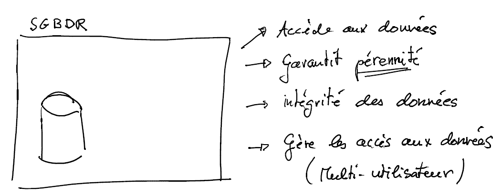
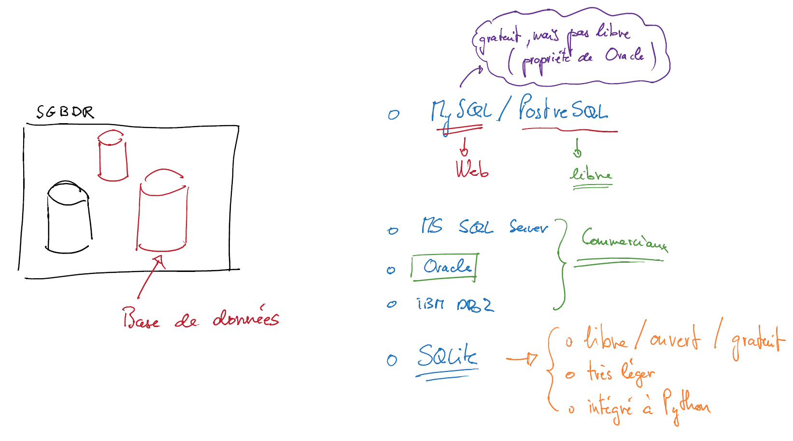
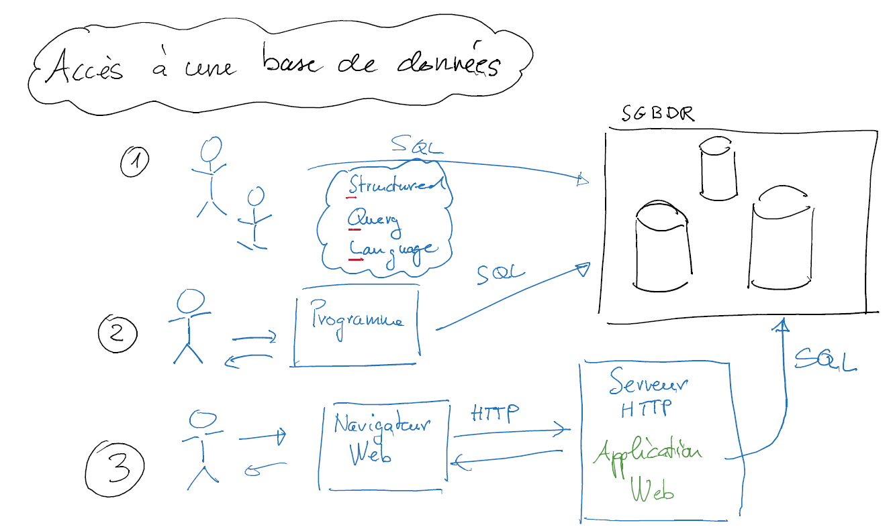

#######################################
Systèmes de gestion de bases de données
#######################################

..	admonition:: Résumé

	Dans cette section, vous apprendrez

	* Ce qu'est un SGBDR

	* Le rôle que jouent les SGBDR dans l'accès aux bases de données

	* Comment on accède à une base de données par l'intermédiaire d'un SGBDR

Notion de système de gestion de bases de données
================================================

..  only:: html

    La vidéo suivante vous présente le concept de systèmes de gestion de bases
    de données et comment on peut accéder aux bases de données grâce à ces
    logiciels souvent fort complexes.

    ..  youtube:: FOyDqPNhzpM

..  only:: latex

    Vous trouverez sur le site du cours une vidéo expliquant en détals le rôle
    et le fonctionnement des systèmes de gestions de bases de données
    relationnels (SGBRD).

    * Lien : http://youtu.be/FOyDqPNhzpM

Résumé
======

Ce qu'est une SGBDR
-------------------

Les SGBDR sont des systèmes très complexes permettant de gérer des bases de
données. En pratique, on n'implémente jamais soi-même une base de données
relationnelle ainsi que les accès à cette base de données. C'est justement le
rôle des SGBDR de s'en occuper.

Un SGBDR implémente donc toute la mécanique compliquée de la gestion des
tables pour le programmeur. Le programmeur n'a pas plus qu'à interagir avec le
SGBDR à l'aide du language SQL dont nous allons étudier quelques rudiments
dans ce cours.

Rôles d'un SGBDR
----------------

Les systèmes de gestion des bases de données jouent un rôle capital dans le
bon fonctionnement de notre société dépendante des informations. La figure
:ref:`figure-role-sgbdr` en fait un petit résumé.

..	_figure-role-sgbdr:

    Quelques fonctions essentielles d'un SGBDR

Exemples de SGBDR
-----------------

La figure :ref:`figure-exemples-sgbdr` montre quelques SGBDR couramment utilisés

..	_figure-exemples-sgbdr:

    Exemples de SGBDR couramment utilisés

Scénarios d'accès aux bases de données
--------------------------------------

La figure :ref:`figure-acces-sgbdr` présente les trois scénarios courant
d'accès à une base de données.

..	_figure-acces-sgbdr:

    Les trois principaux scénarios d'accès aux bases de données

SGBDR utilisé dans ce cours
---------------------------

Dans notre cours, nous allons utiliser SQLite 3 comme système de gestion de
bases de données. SQLite est un petit SGBDR qui est intégré à python grâce au
module ``sqlite3``. SQLite est très répandu : on l'utilise notamment souvent
de manière embarquée dans les téléphones intelligents.
