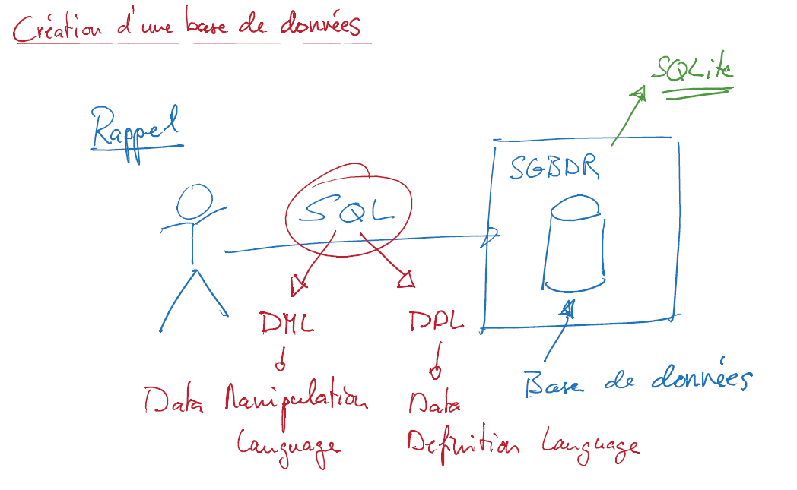
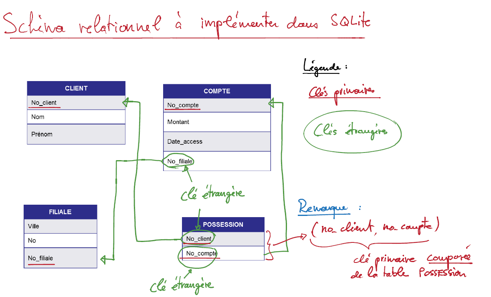
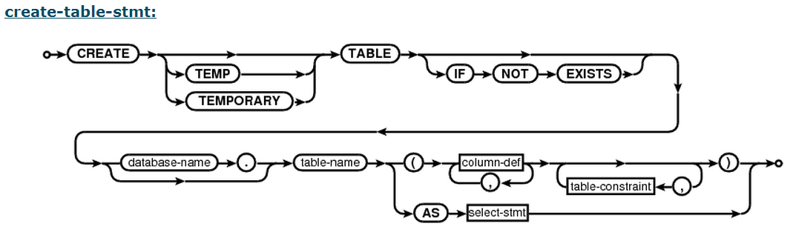
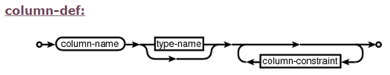
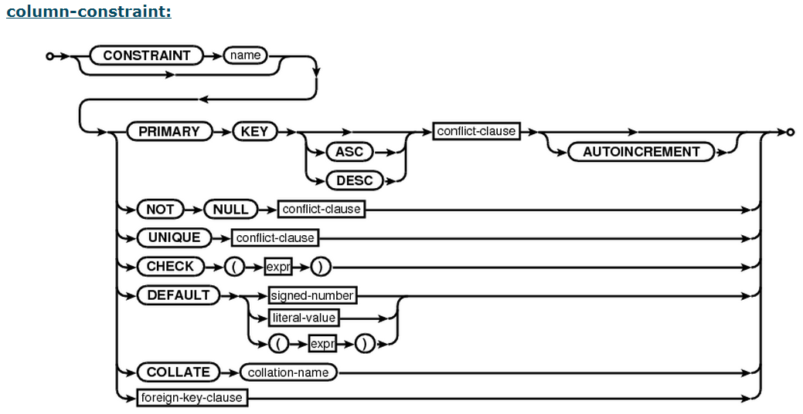
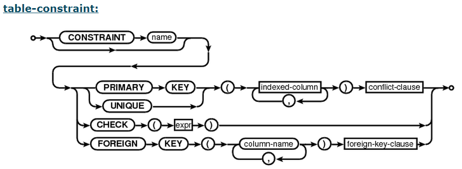
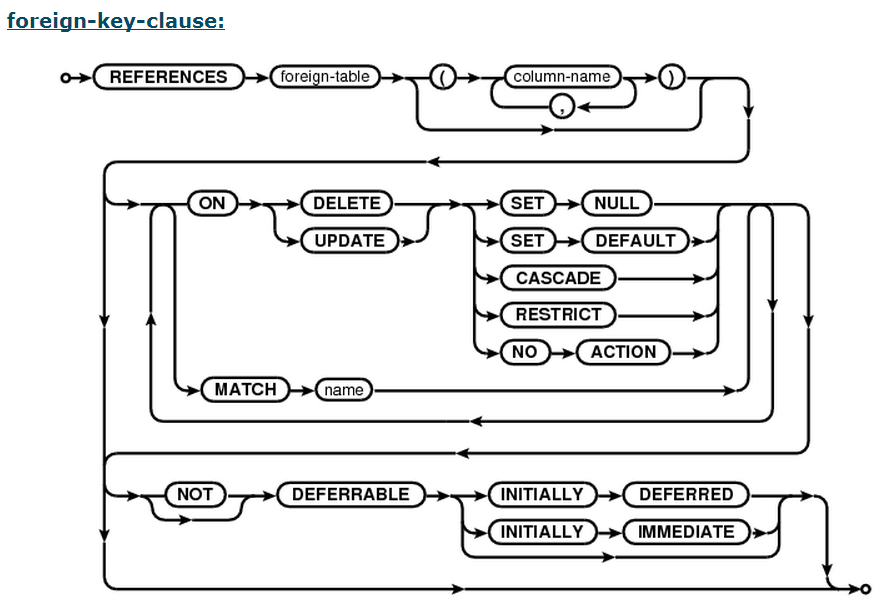

########################################
Création de tables avec ``CREATE TABLE``
########################################

..  only:: prof

    ..  admonition:: TODO

        *   Vidéo pour expliquer les contraintes de tables

        *   contraintes d'intégrité référencielle
    
    ..  admonition:: TODO

        *   Montrer effets et utilité de l'intégrité référentielle en supprimant
            des enregistrements référencés

La syntaxe de la commande ``CREATE TABLE`` permettant de créer la table
``client`` de notre base de données de banque est détaillée sur le site du
SGBDR SGBDR SQlite. 

..	only:: latex

	Vous trouverez sur la page "Création de tables avec ``CREATE TABLE``" du
	site du cours une vidéo montrant comment utiliser la documentation de
	SQLite, plus particulièrement, comment lire les schémas qui détaillent la
	syntaxe de SQL.

..	only:: html

	* **Lien** : http://www.sqlite.org/lang_createtable.html

	Vidéo
	=====

	La vidéo suivante vous montre comment utiliser la documentation de SQLite,
	plus particulièrement, comment lire les schémas qui détaillent la syntaxe
	de SQL.

	..	youtube:: Ps3hsCjBJm4

Résumé de la vidéo
==================

Rappel : communication avec un SGBDR
------------------------------------

La communication avec le SGBDR se fait par le biais du langage SQL qui est
subdivisé en deux catégories de requêtes :

* SQL-DDL (Data Definition Language) qui permet de définir les tables

* SQL-DML (Data Manipulation Language) qui permet de manipuler les données
  contenues dans les tables

La figure :ref:`figure-rappel-dialogue-sgbdr` montre ceci schématiquement.

..	_figure-rappel-dialogue-sgbdr:

    Dialogue avec un SGBDR : SQL-DML et SQL-DDL

Schéma relationnel à implémenter dans SQLite
--------------------------------------------

La figure :ref:`figure-schema-relationnel` montre le schéma relationnel que
nous allons implémenter dans SQLite.

..	_figure-schema-relationnel:

    Schéma relationnel à implémenter dans SQLite

Diagrammes de syntaxe SQL
-------------------------

Toute la documentation de SQLite (http://www.sqlite.org/lang.html) est basé
sur des schémas comme ceux-ci que vous feriez bien d'apprendre à lire !!!

..  _sqlite-create-table-stmt:

    Syntaxe de ``create-table-stmt``

..  _sqlite-create-column-def:

    Syntaxe de ``column-def``   

..  _sqlite-column-constraint:

    Syntaxe de ``column-constraint``    

..  _sqlite-table-constraint:
    

    Syntaxe de ``table-constraint`` 

..  _sqlite-foreign-key-clause:

    Syntaxe de ``foreign-key-clause``

Contraintes de champs
=====================

Chaque colonne d'une table est soumise à certaines contraintes. La syntaxe des
contraintes de champ est spécifiée par
http://www.sqlite.org/syntaxdiagrams.html#column-constraint.

Voici les plus essentielles d'entre elles.

Contraintes de type de données
------------------------------

Les bases de données permettent un grand nombre de types de données pour les
colonnes. Il faut absolument connaître les types suivants :

*   ``INTEGER`` : Nombres entiers. Correspond au type ``int`` de Python

*   ``NUMERIC(p,s)`` : Nombre entier dont le nombre de chiffres significatifs
    est ``p``, dont ``s`` se trouvent après la virgule.

    **Exemple** : ``NUMERIC(6,2)`` permet de stocker des nombres qui ont 4 chiffres
    avant la virgule et 2 chiffres après la virgule

*   ``VARCHAR(n)`` : Chaînes de caractères de longueur maximale ``n``

*   ``FLOAT`` : correspond au type ``float`` de Python

*   ``DATE`` : permet de stocker une date dans le champ

*   ``DATETIME`` : permet de stocker une date et une heure

*   ``BLOB`` : données binaires telles que des images, des vidéos etc ... 
    La taille des données stockable peut être très grande.

..  ===========================================================================

..  admonition:: Types de données dans le SQL Standard

    Dans le standard SQL, il existe un très grand nombre de types de données
    qui ne peuvent être tous cités ici. Le lecteur est prié de se rapporter à
    une source externe, par exemple http://www.tutorialspoint.com/sql/sql-data-types.htm

    La signification de ces types de données peut changer légèrement d'un SGBDR à l'autre.

..  ===========================================================================

..  admonition:: Types de données dans SQLite

    En fait, le SGBDR SQLite ne reconnaît que les types de données suivants :

    * ``NULL`` : The value is a NULL value.

    * ``INTEGER`` : The value is a signed integer, stored in 1, 2, 3, 4, 6, or 8 bytes depending on the magnitude of the value.

    * ``REAL`` : The value is a floating point value, stored as an 8-byte IEEE floating point number.

    * ``TEXT`` : The value is a text string, stored using the database encoding (UTF-8, UTF-16BE or UTF-16LE).

    * ``BLOB`` : The value is a blob of data, stored exactly as it was input.

    **Plus d'informations** : http://www.sqlite.org/datatype3.html

..  ===========================================================================

``NOT NULL``
------------

Cette contrainte permet de spéficier que le champ n'a pas le droit d'être vide

..  code-block:: sql

    CREATE TABLE client (
        nom VARCHAR(20) NOT NULL
    )

``DEFAULT``
-----------

Cette contrainte permet de spéficier une valeur par défaut pour le champ.

..  code-block:: sql

    CREATE TABLE eleve (
        option_art VARCHAR(20) DEFAULT 'musique'
    )

``PRIMARY KEY``
---------------

Cette contrainte permet de spéficier que le champ est une clé primaire. En général, on essaye d'utiliser des clés primaires qui sont des nombres entiers mais il est possible d'utiliser un champ de n'importe quel type en tant que clé primaire.

..  code-block:: sql

    CREATE TABLE client (
        no_client INTEGER PRIMARY KEY
    )

``AUTOINCREMENT``
-----------------

Cette contrainte est utilisée sur un champ de type ``INTEGER PRIMARY KEY``
pour spécifier que le système va s'occuper d'attribuer une valeur à la clé
primaire si rien n'est spécifié lors de l'insertion d'un enregistrement dans
la table. Cela permet de garantir l'unicité des valeurs pour la clé primaire
au sein de la table.

..  code-block:: sql

    CREATE TABLE client (
        no_client INTEGER PRIMARY KEY AUTOINCREMENT
    )

``UNIQUE``
----------

Cette contrainte permet d'imposer que tous les enregistrements de la table
prennent des valeurs différentes pour la champ en question. Ceci est utile
pour demander qu'un champ prenne des valeurs uniques sans que cela soit une
clé primaire. 

Cette contrainte est automatiquement imposée par le SGBDR avec la contraintes
``PRIMARY KEY``.

..  code-block:: sql

    CREATE TABLE citoyen (
        no_avs VARCHAR(20) NOT NULL UNIQUE
    )

Contraintes de tables
=====================

Les contraintes de tables, comme leur nom l'indiquent, ne concernent pas un
champ en particulier mais l'ensemble de la table. Elles sont spécifiées après
la définition des colonnes selon la syntaxe indiquée par
http://www.sqlite.org/syntaxdiagrams.html#table-constraint.

Contraintes de clé primaire composée
------------------------------------

Pour spécifier une clé primaire composée, il n'est pas possible d'utiliser une
contrainte de champ puisque la contrainte concerne plusieurs champs. On
spécifiera une clé primaire composée après la définition des colonnes avec la
syntaxe spécifiée par http://www.sqlite.org/syntaxdiagrams.html#table-constraint

Le code suivant montre un exemple pour la clé primaire composée ``(no_client,
no_compte)`` de la table ``possession`` de la base de données ``banque`` :

..  code-block:: sql

    CREATE TABLE possession
    ( 
        no_compte INTEGER NOT NULL,
        no_client INTEGER NOT NULL,

        -- Clé primaire composée des champs (no_compte, no_client)
        -- contrainte de table
        PRIMARY KEY(no_compte, no_client)
    );

Contraintes d'intégrité référentielle (clés étrangères)
-------------------------------------------------------

Cette contrainte permet de définir une clé étrangère et de spécifier le champ
et la table qu'elle référence.

Dans la base de données ``banque``, le champ ``compte.no_filiale`` référence
le champ ``filiale.no_filiale``

Cela se spécifie de la manière suivante selon la syntaxe indiquée par
http://www.sqlite.org/syntaxdiagrams.html#foreign-key-clause :

..  code-block:: sql

    CREATE TABLE possession
    ( 
        no_compte INTEGER NOT NULL,
        no_client INTEGER NOT NULL,

        -- Clé primaire composée des champs (no_compte, no_client)
        -- contrainte de table
        PRIMARY KEY(no_compte, no_client),

        -- Contraintes d'intégrité référentielle
        FOREIGN KEY (no_compte) REFERENCES compte (no_compte)
            -- Si un compte est effacé, il faut également effacé les 
            -- références à ce compte
            ON DELETE CASCADE,

        FOREIGN KEY (no_client) REFERENCES compte (no_client)
            -- Il ne faut pas pouvoir effacer un client s'il possède
            -- encore des comptes en banque dans la table ``compte``
            ON DELETE NO ACTION
    );

..  admonition:: Remarque
    
    Les clauses ``ON DELETE <action>`` spécifient ce qu'il faut faire si la
    contrainte est violée.

    *   ``ON DELETE CASCADE`` : Tous les enregistrements de la base de données
        qui référencent l'enregistrement qui va être détruit vont être détruits également.
        Ce cas de figure survient par exemple si on essaye de supprimer un compte en banque. 
        Dans ce cas, il faudra également détruire la ligne ``(no_compte, no_client)`` de la 
        table ``possession`` qui fait référence à ce compte pour garantir l'intégrité
        des données.

    *   ``ON DELETE NO ACTION`` : Si la contrainte est violée une erreur est levée et 
        rien ne passe. On utilise ce comportement ici pour indiquer qu'il ne faut pas 
        supprimer un client tant qu'il possède des comptes.

Base de données ``banque`` complète sur ``SQLFiddle``
=====================================================

Les instructions DDL complètes pour la création de la base de données
``banque`` se trouve sur le site SQLFiddle.

* Version Chrome uniquement avec les clauses ``ON DELETE`` : http://sqlfiddle.com/#!7/d6675
* Version Firefox/Chrome sans les clauses ``ON DELETE`` : http://sqlfiddle.com/#!5/c8b0d

Instructions pour la définition des tables
------------------------------------------

Table ``client``
~~~~~~~~~~~~~~~~

..  code-block:: sql

    CREATE TABLE IF NOT EXISTS client
    ( 
        -- définition des colonnes (champs)
        no_client INTEGER PRIMARY KEY AUTOINCREMENT,
        nom VARCHAR(40) NOT NULL,
        prenom VARCHAR(40) NOT NULL

        -- pas de contrainte de table
    );

Table ``filiale``
~~~~~~~~~~~~~~~~~~~~

..  code-block:: sql

    CREATE TABLE IF NOT EXISTS filiale
    ( 
        -- définition des colonnes (champs)
        no_filiale INTEGER PRIMARY KEY AUTOINCREMENT,
        ville VARCHAR(20) NOT NULL,
        no INTEGER NOT NULL DEFAULT 1

        -- pas de contrainte de table
    );

Table ``compte``
~~~~~~~~~~~~~~~~

..  code-block:: sql

    CREATE TABLE IF NOT EXISTS compte
    ( 
        -- définition des colonnes (champs)
        no_compte INTEGER PRIMARY KEY AUTOINCREMENT,
        montant DECIMAL(7,2) NOT NULL DEFAULT 0,
        date_acces DATETIME NULL,
        no_filiale INTEGER NOT NULL,

        -- contrainte de table
        FOREIGN KEY (no_filiale) REFERENCES filiale (no_filiale)
    );

Table ``possession``
~~~~~~~~~~~~~~~~~~~~

..  code-block:: sql

    CREATE TABLE IF NOT EXISTS possession
    ( 
        no_compte INTEGER NOT NULL,
        no_client INTEGER NOT NULL,

        -- Clé primaire composée des champs (no_compte, no_client)
        -- contrainte de table
        PRIMARY KEY(no_compte, no_client),

        -- Contraintes d'intégrité référentielle
        FOREIGN KEY (no_compte) REFERENCES compte (no_compte)
            -- Si un compte est effacé, il faut également effacé les 
            -- références à ce compte
            ON DELETE CASCADE,

        FOREIGN KEY (no_client) REFERENCES compte (no_client)
            -- Il ne faut pas pouvoir effacer un client s'il possède
            -- encore des comptes en banque dans la table ``compte``
            ON DELETE NO ACTION
    );

Ordre de définition des tables
------------------------------

L'ordre de définition des tables est important ! On ne pourrait pas définir la
table ``possession`` avant d'avoir défini les tables ``client`` et ``compte``.
En effet, ces deux tables sont référencées par les contraintes d'intégrités de
clé étrangères de la table ``possession`` qui nécessitent la définition
préalable de ces deux tables.
