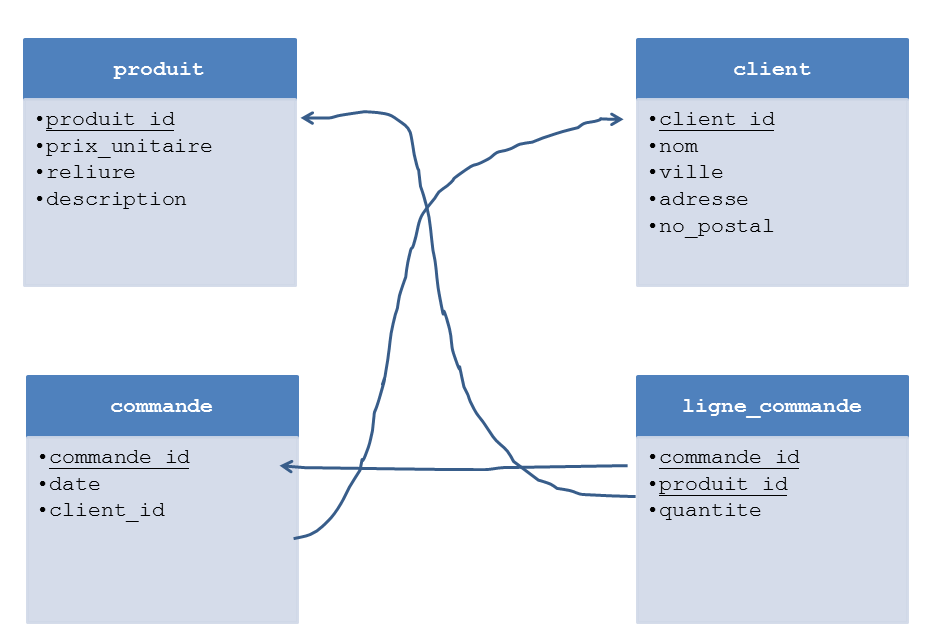

..  _sec-databases-show-library:

###########################################
Contenu de la base de données ``library.db``
###########################################

..  todo::

    Il faudrait modifier la table ``produit`` et mettre un type ``DECIMAL``
    pour le champ ``prix_unitaire``.

    En effet, les montant fiduciaires ne sont jamais spécifiés en type
    ``FLOAT`` qui peut souffrir d'arrondis indésirables.

..  admonition:: Lien SQLFiddle.com

    Le lien suivant permet de travailler directement sur la base de données.
    Il n'y a pas de risque de corrompre la base de données, même avec des
    instructions comme ``DELETE``, ``UPDATE``, ``ALTER TABLE``, etc ...

    **Lien SQLFiddle** : http://sqlfiddle.com/#!7/a7459

    **Téléchargement du fichier SQLite** : :download:`library.db`

Schéma relationnel
==================

    Schéma relationnel de la base de données ``library.db``

Contenu des tables
==================

..
    Table ``{table}``
    -----------------

    ..  code-block:: sql

        SELECT * FROM {table}

    ..  sqltable:: 
        :connection_string: sqlite:///library.db
        :class: ocidbtable

        SELECT * FROM {table}

Table ``client``
-----------------

..  code-block:: sql

    SELECT * FROM client

..  sqltable:: 
    :connection_string: sqlite:///library.db
    :class: ocidbtable

    SELECT * FROM client

Table ``commande``
-----------------

..  code-block:: sql

    SELECT * FROM commande

..  sqltable:: 
    :connection_string: sqlite:///library.db
    :class: ocidbtable

    SELECT * FROM commande

Table ``produit``
-----------------

..  code-block:: sql

    SELECT * FROM produit

..  sqltable:: 
    :connection_string: sqlite:///library.db
    :class: ocidbtable

    SELECT * FROM produit

Table ``ligne_commande``
-----------------

..  code-block:: sql

    SELECT * FROM ligne_commande

..  sqltable:: 
    :connection_string: sqlite:///library.db
    :class: ocidbtable

    SELECT * FROM ligne_commande

Instructions SQL DDL
====================

..  literalinclude:: library.sql
    :language: sql

