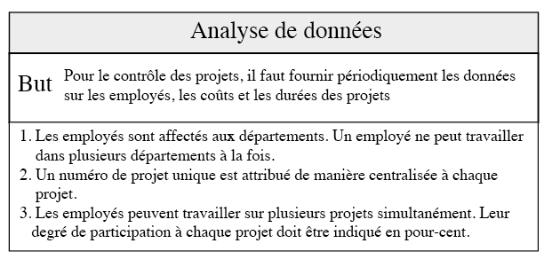
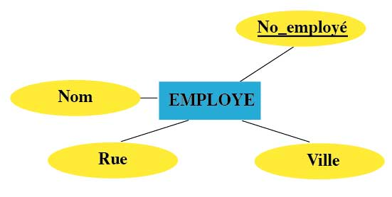
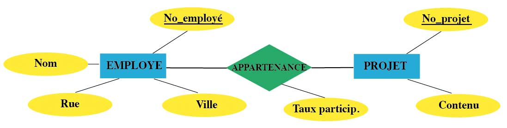
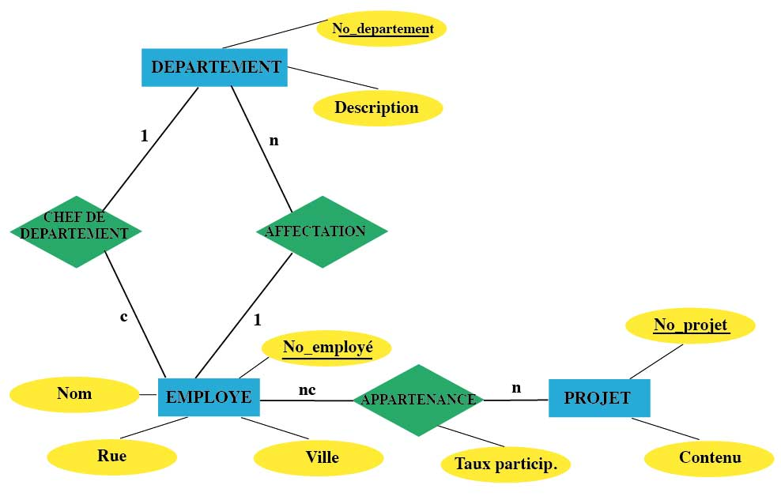
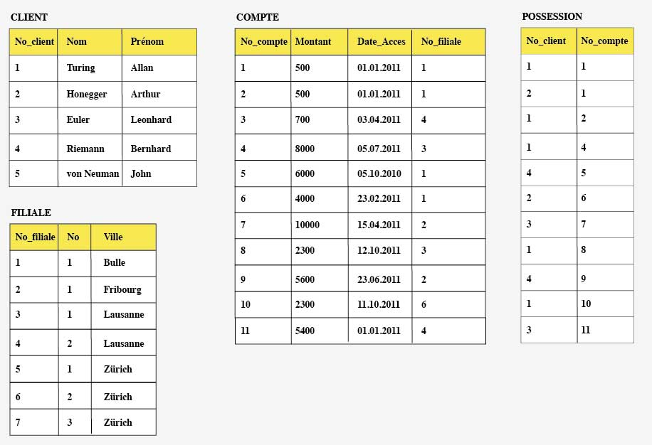
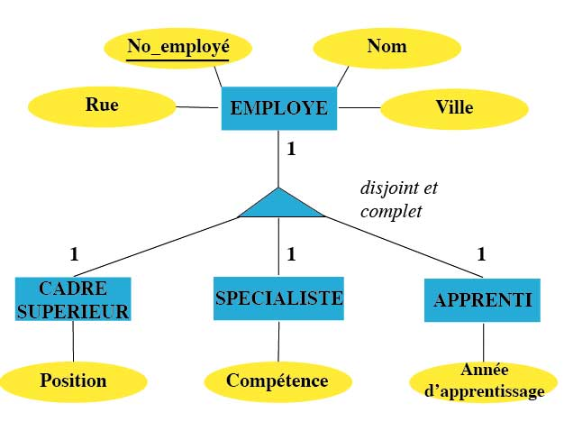

Modèle entité-association
=========================

.. admonition:: Source

   Cette section est empruntée avec permission au cours de bases de données de Jérôme Charrière, Collège du Sud.

Introduction
~~~~~~~~~~~~

Une démarche de conception de base de données doit permettre la
définition de tables nécessaires aux besoins d'un ensemble
d'utilisateurs. Cette base de données est relative à un domaine
d'activité tel que la gestion d'une bibliothèque, d'un service
hospitalier, du département de marketing d'une entreprise ou de son
service du personnel, la gestion de la production d'énergie ou encore
des infractions au code de la route. La base de données doit contenir
toutes les données nécessaires à la représentation du domaine d'activité
sous forme de tables afin de permettre leur gestion par ordinateur.

Lorsque le problème est simple, un utilisateur un tant soit peu habile
pourrait exprimer directement ses besoins en termes de tables, colonnes
et contraintes. Néanmoins, lorsque le domaine d'activité présente une
certaine complexité, il devient difficile de raisonner à son sujet en
termes de tables et de colonnes. Dans ce cas, il est d'usage de
commencer par une modélisation de la problématique à traiter d'un point
de vue conceptuel et indépendamment du logiciel utilisé. La modélisation
conceptuelle la plus utilisée dans le monde des bases de données est le
modèle **entité-association**. Ce schéma conceptuel très utilisé pour
les bases de données, a été inventé par Peter Pin-Shan CHEN en 1975 et
est destiné à clarifier l'organisation des données dans les bases de
données sans s'attacher à la manière dont elles seront représentées en
tables et colonnes.

Afin d'illustrer ce modèle au travers d'un exemple concret, nous
considérerons le cas d'une entreprise qui, pour gérer ses projets
informatiques, veut rassembler des informations sur ses employés, sur
les plans des projets et sur ses départements. Une analyse de donnée,
effectuée par exemple sous la forme d'interviews ou de questionnaires,
pourrait aboutir à la liste d'informations suivante:

    Analyse de données

Les entités
~~~~~~~~~~~

Le modèle entité-association (EA) a pour but de donner une
représentation simplifiée de la réalité. Cette réalité est constituée
d'objets appelé **entités**. Une entité est un objet du monde réel ou de
notre pensée pouvant être identifié distinctement parmi d'autres objets.
Elle peut désigner des objets concrets inanimés (des véhicules), des
objets concrets animés (des clients) des conventions abstraites (des
contrats d'assurance) ou encore des événements (des accidents). Les
entités de même type forment un **ensemble d'entités** caractérisées par
un certain nombre d'\ **attributs**: nom, prénom, adresse, taille,
poids, etc. Par la suite, nous verrons que chaque attribut est spécifié
par son **type**: numérique, chaîne de caractères, entier, date, etc.
Pour chaque ensemble d'entités, nous définissons une **clé
d'identification**, c'est-à-dire un attribut ou une combinaison
d'attributs permettant de distinguer sans ambiguïté les entités dans
l'ensemble considéré. Dans le modèle EA, les ensembles d'entités sont
représentés graphiquement par des rectangles et les attributs par des
ovales. En outre, la clé est généralement soulignée.

Partant de l'analyse des données ci-dessus, nous découvrons que notre
exemple comporte trois principaux ensembles d'entités que nous écrirons
en majuscules: ``DEPARTEMENT``, ``EMPLOYE`` et ``PROJET``. En plus du nom et de
l'adresse qui caractérisent un employé spécifique, l'entreprise devra
ajouter un attribut artificiel, le numéro d'employé, qui permettra de
déterminer chacun des employés (entités) au sein du personnel (ensemble
d'entités) de manière unique:

    Représentation d'un ensemble d'entités dans le modèle EA

Comme nous le verrons dans la section suivante, les clés
d'identification permettent de relier les différentes tables d'une base
de données.

Les liens
~~~~~~~~~

Entre les ensembles d'entités s'établissent d'importants **liens** qui
forment également un ensemble. Les ensembles de liens se caractérisent
aussi par leurs propres attributs et sont représentés sous la forme de
losanges dans le modèle EA. Par exemple, pour savoir sur quel projet
travaille chaque employé, on définit l'ensemble de liens ``APPARTENANCE``
que l'on connecte aux ensembles d'entités ``EMPLOYE`` et ``PROJET`` dans le
diagramme. L'ensemble de liens ``APPARTENANCE`` contient toutes les
participations des employés aux projets de l'entreprise. Il se
caractérise par l'attribut «Taux de participation» qui indique le
pourcentage du temps de travail qu'un employé consacre à son projet:

    Représentation d'un ensemble de liens dans le modèle EA

Les liens définissent toujours des associations dans les deux
directions. Du point de vue de l'ensemble ``EMPLOYE``, nous interprétons
l'ensemble des liens ``APPARTENANCE`` en spécifiant qu'un employé peut
participer à plusieurs projets. Du point de vue de l'ensemble d'entités
``PROJET``, le lien exprime le fait qu'un projet est réalisé par plusieurs
employés. Aussi, afin d'indiquer le nombre d'entités de l'ensemble
d'arrivée participant à l'association avec une entité de l'ensemble de
départ, il est habituel de caractériser chaque association formant un
lien par son **type**. On distingue habituellement quatre types
d'associations:

-  **Association simple, notée 1**

   Dans ce type d'association, à chaque entité de l'ensemble de départ
   correspond *une et une seule* entité dans l'ensemble d'arrivée. Par
   exemple, selon notre analyse des données, chaque employé est affecté
   à un seul département. Ainsi, l'association ``AFFECTATION`` des employés
   aux départements est simple.

-  **Association conditionnelle, notée c**
   
   Dans ce type d'association, à chaque entité de l'ensemble de départ
   correspond *au plus une* entité dans l'ensemble d'arrivée. Par
   exemple, l'association ``CHEF_DE_DEPARTEMENT`` reliant l'ensemble
   d'entités ``EMPLOYE`` à l'ensemble ``DEPARTEMENT`` est conditionnelle dans la
   mesure où un employé n'exerce pas forcément la fonction de chef de
   département.

-  **Association multiple, notée n**
   
   Dans ce type d'association, à chaque entité de l'ensemble de départ
   correspond *une ou plusieurs* entités de l'ensemble d'arrivée. Par
   exemple, l'association ``APPARTENANCE`` des projets aux employés est
   multiple dans la mesure où chaque projet est réalisé par un ou
   plusieurs employés.
-  **Association multiple conditionnelle, notée nc**
   
   Dans ce type d'association, à chaque entité de l'ensemble de départ
   correspond *aucune, une ou plusieurs* entités de l'ensemble
   d'arrivée. Par exemple, l'association ``APPARTENANCE`` considérée du
   point de vue d'un employé est multiple conditionnelle dans la mesure
   où un employé ne participe pas obligatoirement à un projet et peut
   contribuer à plusieurs projets à la fois.

Les types d'associations *multiples* et *multiple conditionnelle* sont
dits **complexes** dans la mesure où une entité de l'ensemble de départ
peut être reliée à un nombre quelconque d'entités de l'ensemble
d'arrivée.

Les types d'association sont généralement placés sur le modèle EA du
côté d'où démarre l'association comme indiqué dans l'exemple ci-dessous
résumant les cas exposés précédemment:

    Modèle EA incluant les types d'associations

Les types d'association d'un lien déterminent son **degré**. Comme
chaque lien comprend deux types d'associations, son degré est défini
comme une paire de type d'associations. Par exemple, le lien
``APPARTENANCE`` entre les ensembles d'entités ``EMPLOYE`` et ``PROJET`` est de
degré (nc, n). Il est dès lors possible de classer les liens entre deux
ensembles d'entités en fonction de leur degré. Nous parlerons de lien

-  **un-à-un** lorsque son degré consiste en deux types d'associations
   simples ou conditionnelles. En d'autres termes, cette catégorie est
   formée des liens de degré (1, 1), (1, c), (c, 1) et (c, c).
-  **un-à-plusieurs** lorsque son degré consiste en un type
   d'associations simple ou conditionnelle et un type d'association
   multiple ou multiple conditionnelle. En d'autres termes, cette
   catégorie est formée des liens de degré (1, n), (1, nc), (c, n), (c,
   nc), (n, 1), (n, c), (nc, 1) et (nc, c).
-  **plusieurs-à-plusieurs** lorsque son degré consiste en deux types
   d'associations multiples ou multiples conditionnelles. En d'autres
   termes, cette catégorie est formée des liens de degré (n, n), (n,
   nc), (nc, n), (nc, nc).

Dans l'exemple ci-dessus, ``CHEF_DE_DEPARTEMENT`` est un lien un-à-un,
``AFFECTATION`` est un lien un-à-plusieurs et ``APPARTENANCE`` est un lien
plusieurs-à-plusieurs.

Exercice 1
--------

D'une discussion avec une entreprise responsable d'une librairie en
ligne, vous parvenez à faire ressortir la liste des informations
factuelles suivantes:

-  L'entreprise vend des livres
-  Chaque livre possède un unique éditeur et chaque éditeur publie au
   moins un livre
-  L'entreprise obtient ses livres auprès de fournisseurs. Chaque livre
   est fourni exclusivement par un fournisseur mais chaque fournisseur
   est à même de fournir plusieurs livres.
-  L'entreprise a des client passant des commandes. Chaque client peut
   passer 0, 1 ou plusieurs commandes mais une commande est toujours
   passée par un et un seul client.
-  Une commande doit comprendre au moins un livre et un livre peut faire
   partie de 0, 1 ou plusieurs commandes.
-  L'entreprise dispose d'un certains nombres d'employés.
-  A chaque commande correspond un employé responsable et chaque employé
   peut assurer le suivi de 0, 1 ou plusieurs commandes.

A l'aide d'un diagramme entité-association, modélisez la structure des
informations nécessaire au développement d'un logiciel capable de gérer
la librairie en ligne, sans vous attardez sur les attributs propres à
chaque entité en présence.

..  only:: corrige

    ..  admonition:: Solution

        Après analyse des données à modéliser, nous nous apercevons que
        celles-ci sont formées de 6 entités (``LIVRE``, ``EDITEUR``, ``FOURNISSEUR``,
        ``EMPLOYE``, ``CLIENT`` et ``COMMANDE``) que nous pouvons directement représenter
        dans le diagramme sous la forme de rectangles. Une fois les entités
        posées, il y a lieu de s'interroger quant aux associations les reliant.
        En se référant à l'analyse des données du problème, on constate qu'il y
        a un lien de degré (1,n) entre les entités ``LIVRE`` et ``EDITEUR``, un lien de
        degré (1,n) entre les entités ``LIVRE`` et ``FOURNISSEUR``, un lien de degré (1,
        nc) entre les entités ``COMMANDE`` et ``CLIENT``, un lien de degré (n, nc) entre
        les entités ``COMMANDE`` et ``LIVRE`` et finalement un lien de type (nc, 1)
        entre les entités ``COMMANDE`` et ``EMPLOYE``. En assemblant ces différentes
        représentations, nous obtenons le modèle entités-associations suivant:

        ..  figure:: figures/modele5.jpg
            :align: center
            :width: 90%

            Une possibilité parmi d'autres pour le schéma entités-associations

Exercice 2
--------

La base de données ci-dessous répertorie des informations relatives à
des comptes bancaires qui appartiennent à des clients et qui sont gérés
par différentes filiales de la banque. Après avoir étudié les liens
qu'entretiennent les différentes tables de la base de données,
établissez le diagramme entité-association de la base de données.

..  only:: corrige

    ..  admonition:: Solution

        ..  figure:: figures/modele9.jpg
            :align: center
            :width: 90%

            Une possibilité parmi d'autres pour le schéma entité-association 

Spécialisation et généralisation
~~~~~~~~~~~~~~~~~~~~~~~~~~~~~~~~

Il n'est pas rare que des entités d'une même catégorie partagent des
attributs communs et des attributs distincts. Il faut alors subdiviser
l'entité principale en sous-entités de catégories différentes afin de
décrire leurs attributs spécifiques. On parle alors de
**spécialisation**. Ainsi, par exemple, l'ensemble des moyens de
transports peut se subdiviser en plusieurs ensembles de sous-entités:
les bus, les trains, les bateaux ou les téléphériques. Ces entités ont
des attributs communs en tant que véhicule (vitesse maximale, nombre
maximal de passagers,...) mais possèdent également leurs propres
attributs spécialisés (tirant d'eau pour les bateaux, nombre de câbles
porteur pour les téléphériques,...).

Dans le modèle EA, il faut plusieurs ensembles pour décrire les
attributs communs et spécifiques aux entités. Un ensemble principal
d'entités contiendra tous les attributs communs de chaque entité, alors
que différents sous-ensembles d'entités spécifiques contiendront les
attributs particuliers des différentes entités. L'ensemble des entités
générales est alors relié aux ensembles d'entités spécialisées à l'aide
d'un triangle accompagné de différentes mentions selon le cas de
spécialisation représenté. En effet, le processus de spécialisation peut
donner lieu à plusieurs cas possibles:

-  **Cas avec intersection**

   Imaginons que l'ensemble des entités ``EMPLOYE`` consiste en deux
   sous-ensembles, ``CLUB_DE_PHOTO`` et ``CLUB_DE_SPORT``. Chaque membre d'un
   club est donc en même temps un employé. Réciproquement, un employé
   peut être membre actif des deux clubs internes de l'entreprise pour
   la photo et le sport. Les sous-ensembles ``CLUB_DE_PHOTO`` et ``CLUB`` DE
   ``SPORT`` ont donc une intersection non vide, c'est-à-dire qu'il existe
   des entités de l'ensemble général pouvant être classées dans plus
   d'une entité spécifique.

-  **Cas avec intersection et complet**
   
   Définissons un troisième sous-ensemble d'entités ``CLUB_D_ECHEC`` et
   admettons qu'à l'embauche chaque employé adhère au moins à l'un des
   trois club, ``CLUB_DE_PHOTO``, ``CLUB_DE_SPORT`` ou ``CLUB_D_ECHEC``. Par
   conséquent, ces trois sous-ensembles contiennent tous les éléments de
   l'ensemble ``EMPLOYE`` d'une part et présentent des intersections non
   vides d'autre part. En effet, un employé qui est membre d'au moins un
   club peut adhérer à deux ou trois clubs simultanément.

-  **Cas disjoint**
   
   Considérons l'ensemble des entités ``EMPLOYE`` et ses deux
   sous-ensembles spécialisés, ``CADRE`` ``SUPERIEUR`` et ``SPECIALISTE``. Puisqu'un
   employé ne peut pas occuper un poste de cadre supérieur et travailler
   en même temps comme spécialiste, ces deux sous-ensembles sont
   disjoints, c'est-à-dire ont une intersection vide, c'est-à-dire
   qu'aucune entité de l'ensemble générale ne peut être classée dans
   plus d'une entité spécifique.

-  **Cas disjoint et complet**
   
   Dans l'exemple précédent, définissons un troisième sous-ensemble
   ``APPRENTI``. Nous constatons que chaque employé travaille soit comme
   cadre supérieur, soit comme spécialiste, soit comme apprenti. En
   d'autres termes, pour chaque entité dans l'ensemble d'entités
   ascendant, il existe une sous-entité définie par spécialisation et
   vice-versa.

La figure suivante illustre le cas *disjoint et complet* où l'ensemble
d'entité ``EMPLOYE`` se spécialise en sous-ensembles d'entités ``CADRE``
``SUPERIEUR``, ``SPECIALISTE`` ou ``APPRENTI``. Comme chaque cadre supérieur, chaque
spécialiste et chaque apprenti est un employé, cette spécialisation est
une association de type 1. L'association dans la direction inverse est
également de type 1 dans le cas *disjoint et complet* dans la mesure où
chaque employé appartient à un et un seul sous-ensemble d'entités.

    Spécialisation dans l'exemple ``EMPLOYE``

Remarquons dans l'exemple ci-dessus que l'entité principale ``EMPLOYE`` se
caractérise par des attributs communs à tous les employés tels que le
nom, la rue et la ville alors que d'autres attributs sont spécifiques à
tel ou tel type d'employé: la position d'un cadre, la compétence d'un
spécialiste ou l'année d'apprentissage d'un apprenti.

Exercice 3
--------

Une entreprise aimerait mettre en place un système informatique pour
gérer efficacement l'un de ses secteurs d'activité: une chaîne d'hôtels
situés dans diverses grandes villes. D'une discussion avec l'un des
responsables du projet, vous parvenez à faire ressortir la liste des
informations factuelles suivantes:

-  Chaque hôtel a plusieurs employés, dont un(e) directeur(-trice)
   unique.
-  Chaque employé est affecté à un seul hôtel.
-  Chaque hôtel possède plusieurs chambres et une chambre appartient
   toujours à un hôtel.
-  Les hôtels n'offrent que deux catégories de chambres mutuellement
   exclusives, à savoir:

   -  les chambres simples caractérisées par le type de salle de bain
      (douche ou bain)
   -  les chambres doubles caractérisées par le type de lit (double ou
      jumeau)

   Les attributs communs aux deux catégories de chambres sont le numéro,
   le prix et la description de la chambre.
   
-  Chaque employé peut (ou non) être amené à effectuer des services
   (nettoyage, inspection du mini bar, réparation,...) dans les chambres
   et chaque chambre est servie par plusieurs employés durant l'année.
   Les attributs spécifiques à chaque service sont le type, la date et
   un commentaire.
-  Sur une année, chaque chambre est réservée par au moins un client
   enregistré dans la base de donnée. Un client peut soit ne rien
   réserver, soit réserver une ou plusieurs chambres. De plus, chaque
   réservation doit offrir les informations concernant la date de
   réservation, la date d'arrivée, la durée et le type de séjour (basic,
   demi-pension ou pension-complète).

A l'aide d'un diagramme entité-association, modélisez la structure des
informations nécessaire au développement du système de gestion des
hôtels.

..  only:: corrige

    ..  admonition:: Solution

        ..  figure:: figures/modele7.jpg
            :align: center
            :width: 90%

            Une possibilité parmi d'autres pour le schéma entité-association 

