******************************************
Du modèle conceptuel au modèle relationnel
******************************************

.. admonition:: Source

   Cette section est empruntée avec permission au cours de bases de données de Jérôme Charrière, Collège du Sud.

Introduction
~~~~~~~~~~~~

Le modèle entité-association décrit dans la section précédente est un
modèle abstrait, pas directement implantable dans un ordinateur. Il faut
par conséquent le traduire en un **schéma de base de données
relationnelle** sous forme de tables, de colonnes et de contraintes
d'intégrité. Un schéma de base de données relationnelles contient la
définition des tables, des attributs et des clés primaires. Les
contraintes d'intégrité imposeront des limites aux domaines de
définition des attributs et définiront des dépendances entre les tables
de la base de données.

Le passage du modèle entité-association à un schéma de base de données
conduisant à plusieurs variantes possibles, il incombe aux architectes
de données de prendre les décisions appropriées. Remarquons néanmoins
que de mauvais choix peuvent engendrer des redondances dans la base de
données impliquant par les suites des incohérences lors de l'insertion,
de la suppression ou de la modification de certaines données dans la
base. A titre d'exemple, considérons la table ``EMPLOYE`` qui contiendrait,
pour chaque employé de l'entreprise pour laquelle vous concevez une base
de données, le nom, la rue, la ville ainsi que le numéro et la
description du département auquel est affecté l'employé en question:

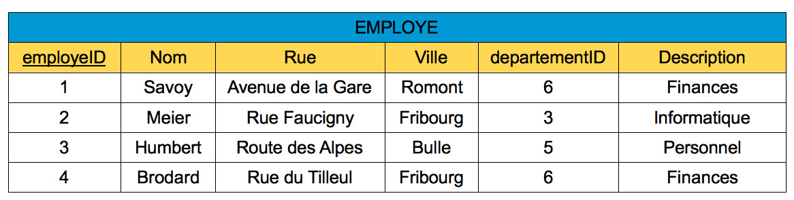

    Table contenant des redondances et des anomalies

Dans l'exemple ci-dessus, le nom du département «Finances» apparaît pour
chaque employé du département numéro 6. Il en est de même pour les
autres départements car plusieurs employés peuvent travailler dans un
même département. Puisque le nom d'un département donné apparaît
plusieurs fois dans la table, l'attribut «Description» est redondant.
Or, une table contenant des informations redondantes peut entraîner des
**anomalies de mutation** pouvant se présenter sous trois formes:

-  **Anomalie d'insertion**
   
   Supposons qu'il faille définir un nouveau département «Marketing»
   dans l'entreprise. Avec la table actuelle, cette opération est
   impossible sans insérer un nouvel employé ou modifier l'attribution
   d'un employé existant. Il existe donc une *anomalie d'insertion* car
   nous ne pouvons insérer aucune nouvelle ligne dans la table sans
   donner un numéro d'employé unique.

-  **Anomalie de suppression**
   
   En supprimant de la table tous les employés d'un même département,
   nous perdons simultanément le numéro et la désignation du département
   en question. Nous parlons alors d'*anomalie de suppression* dans la
   mesure où nous perdons des informations involontairement.

-  **Anomalie de mise à jour**
   
   Si la description du département numéro 6 devient «Service des
   finances» au lieu de «Finances», il est nécessaire d'appliquer ce
   changement de nom à l'ensemble des employés du département concerné.
   En d'autres termes, même si la mise à jour ne porte que sur une seule
   pièce d'information, elle entraîne une adaptation de la table ``EMPLOYE``
   à plusieurs endroits différents. Cet inconvénient s'appelle *anomalie
   de mise à jour*.

Afin d'éviter l'apparition de redondance et des anomalies qui en
résultent, une meilleure approche que celle présentée ci-dessus consiste
à enregistrer une fois pour toutes la description de chaque département
dans une table séparée au lieu de la répéter pour chaque employé:

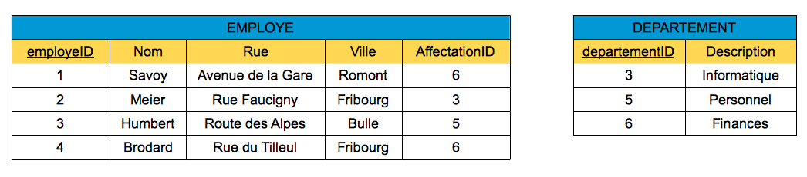

    Tables ne contenant plus de redondance

Cette section a pour but de définir une méthode permettant de
représenter les ensembles d'entités et de liens par des tables. Des
règles simples permettent de traduire correctement un modèle
entité-association en un schéma de base de données relationnelle
cohérente. La méthode présentée dans cette section se composera de trois
étapes.

Étape 1: Les ensembles d'entités
~~~~~~~~~~~~~~~~~~~~~~~~~~~~~~~~

Chaque ensemble d'entités doit être traduit en une table distincte dont
le nom correspond au nom de l'ensemble d'entités. La clé primaire unique
de la table correspond à la clé d'identification de l'ensemble d'entités
et est identifiée dans la table par son soulignement. Les autres
attributs de l'ensemble d'entités forment les autres colonnes de la
table.

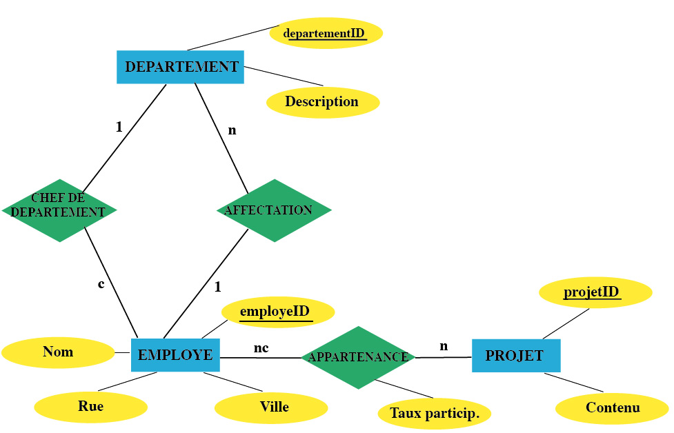

    Schéma entité-association

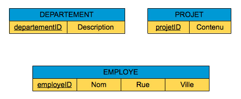

    Application de l'étape 1

Dans l'exemple ci-dessus, nous remarquons que les ensembles d'entités
``DEPARTEMENT``, ``EMPLOYE`` et ``PROJET`` ont été traduits en trois tables portant
les mêmes noms respectifs.

Étape 2: Les ensembles de liens
~~~~~~~~~~~~~~~~~~~~~~~~~~~~~~~

Chaque ensemble de liens *peut* être traduit en une table distincte.
Elle doit alors contenir les clés primaires des ensembles d'entités
participantes comme **clés étrangères**. La clé primaire de la table
ainsi obtenue est alors généralement la concaténation des clés
étrangères. Les autres attributs de l'ensemble de liens complètent les
colonnes de la table.

Une **clé étrangère** dans une table est un attribut qui sert de clé
primaire dans une autre table et permet d'établir les liens désirés
entre les tables en question.

    Schéma des liens de la base de donnée Entreprise

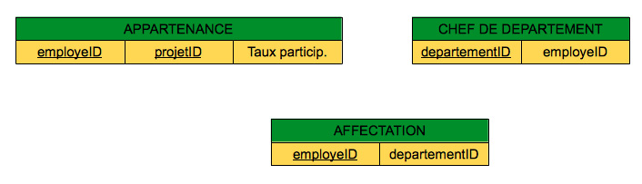

    Transformation des liens en autant de tables

Dans l'exemple ci-dessus, nous avons créé une table pour chacun des
ensembles de liens ``CHEF`` DE ``DEPARTEMENT``, ``AFFECTATION`` et ``APPARTENANCE``.
Dans les tables ``CHEF`` DE ``DEPARTEMENT`` et ``AFFECTATION``, les clés étrangères
sont respectivement le numéro du département et le numéro de l'employé.
La table ``APPARTENANCE`` utilise quant à elle les clés d'identification des
tables ``EMPLOYE`` et ``PROJET`` comme clés étrangères et contient un attribut
appelé ``Taux participation``.

Etant donné que chaque département est dirigé par un seul chef, le
numéro de département ``departementID`` suffit pour former la clé
primaire de la table ``CHEF`` DE ``DEPARTEMENT``. De même, le numéro d'employé
``employeID`` suffit pour définir la clé d'identification de la table
``AFFECTATION``, car chaque employé est affecté à un seul département.
Néanmoins, la clé d'identification de la table ``APPARTENANCE`` doit être
formée par la concaténation de deux clés étrangères: le numéro d'employé
et le numéro de projet. En effet, un employé peut participer à plusieurs
projets et, inversement, un projet peut impliquer plusieurs employés.

La transformation en table distincte de chaque ensemble de liens ne
conduit pas toujours à un schéma de base de données relationnelle
optimal. En effet, selon les circonstances, elle pourrait engendrer un
grand nombre de tables. En se référant à l'exemple ci-dessus, nous
pourrions nous demander s'il est judicieux de créer une nouvelle table
pour représenter la fonction de chef de département. En effet, cette
fonction pourrait être intégrée dans la table ``DEPARTEMENT`` tout
simplement comme attribut supplémentaire dont la valeur correspondrait
au numéro d'employé du chef pour chaque département.

Dès lors, le passage d'un ensemble de liens du modèle entité-association
aux tables du modèle relationnel se fait en fonction du degré de
l'ensemble de liens considéré:

-  | **Liens plusieurs-à-plusieurs**

   Un ensemble de liens plusieurs-à-plusieurs **doit** être traduit en
   une table relationnelle distincte dont le nom correspond au nom de
   l'ensemble de liens. Elle contient les clés d'identification des
   ensembles d'entités participantes comme clés étrangères et sa clé
   primaire est alors la clé formée par la concaténation des clés
   étrangères. Cette table fait donc office de table de correspondance
   entre les entités participant à la relation. Notons que les autres
   attributs de l'ensemble de liens complètent les colonnes de la table.

   ..  figure:: figures/rel4.jpg
       :align: center
       :width: 90%

          Schéma de l'ensemble de liens ``APPARTENANCE``

   ..  figure:: figures/rel5.jpg
       :align: center
       :width: 90%

          Transformation des liens plusieurs-à-plusieurs

   Dans l'exemple ci-dessus, nous avons créé une table pour l'ensemble
   de liens ``APPARTENANCE``. Cette table utilise les clés primaires des
   tables ``EMPLOYE`` et ``PROJET`` comme clés étrangères et contient un autre
   attribut appelé ``Taux participation`` qui indique le degré
   d'appartenance d'un employé à un projet en pour-cent. La clé primaire
   de la table ``APPARTENANCE`` est formée par la concaténation des clés
   étrangères: le numéro d'employé et le numéro de projet. En effet, un
   employé peut participer à plusieurs projets et, inversement, un
   projet peut impliquer plusieurs employés.

-  | **Liens un-à-plusieurs**

   Un ensemble de liens un-à-plusieurs peut s'exprimer dans l'une des
   tables des ensembles d'entités participantes *sans avoir besoin de
   créer une table distincte*. A ce dessein, dans la table d'où part
   l'association simple ou conditionnelle, il est nécessaire de définir
   une clé étrangère qui fait référence à l'autre table de
   l'association. Pour mettre en évidence le lien, il convient d'ajouter
   un **nom de rôle** au nom de la clé primaire correspondante,
   explicitant la signification de ses valeurs dans la table étrangère.

   ..  figure:: figures/rel6.jpg
       :align: center
       :width: 90%

          Schéma de l'ensemble de liens ``AFFECTATION``

   ..  figure:: figures/rel7.jpg
       :align: center
       :width: 90%

          Transformation des liens un-à-plusieurs

   Dans l'exemple ci-dessus, pour exprimer les liens qu'il existe entre
   les départements et les employés de l'entreprise, nous avons ajouté à
   la table ``EMPLOYE`` une clé étrangère ``AffectationID``. Pour chaque
   employé, la valeur de cette clé indique le numéro du département
   auquel il est affecté. La liaison établie par la clé étrangère est
   définie par un attribut dont le nom se compose de son rôle dans la
   liaison.

-  | **Liens un-à-un**

   Un ensemble de liens un-à-un peut s'exprimer dans les deux tables des
   ensembles d'entités participantes *sans avoir besoin de créer une
   table distincte*. A ce dessein, la clé primaire de la table
   référencée est choisie comme clé étrangère dans la seconde table. Il
   est important de désigner correctement l'une des deux tables dans
   laquelle nous choisissons une clé étrangère. En principe, nous
   introduisons la clé étrangère de la table référencée dans la table
   d'où part l'association de type simple.

   ..  figure:: figures/rel8.jpg
       :align: center
       :width: 90%

          Schéma de l'ensemble de liens ``CHEF`` DE ``DEPARTEMENT``

   ..  figure:: figures/rel9.jpg
       :align: center
       :width: 90%

          Transformation des liens un-à-un

   Dans l'exemple ci-dessus, nous complétons la table ``DEPARTEMENT`` par le
   numéro d'employé du chef de département. Ainsi, l'ensemble de liens
   ``CHEF`` DE ``DEPARTEMENT`` s'exprime à travers l'attribut ``ChefDepID``.
   Chaque valeur de cette clé étrangère identifie un employé dans le
   rôle de chef de département.

Les règles de transformation de liens permettent donc d'aboutir au
schéma logique suivant:

    Schéma entité-association

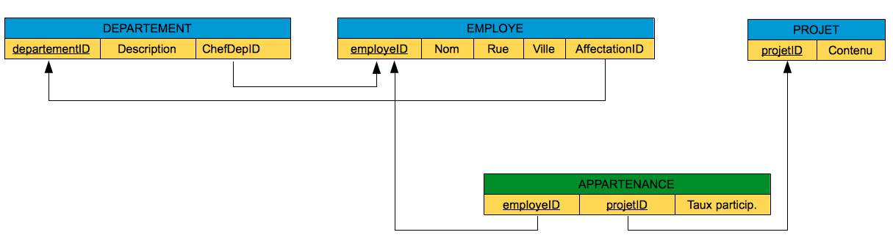

    Schéma relationnel correspondant

Exercice sur l'étape 2 
~~~~~~~~

En vous basant sur le schéma entités-associations ci-dessous
représentant la structure des données nécessaires à la gestion d'une
librairie en ligne, créez le schéma logique de la base de données
relationnelle associée:

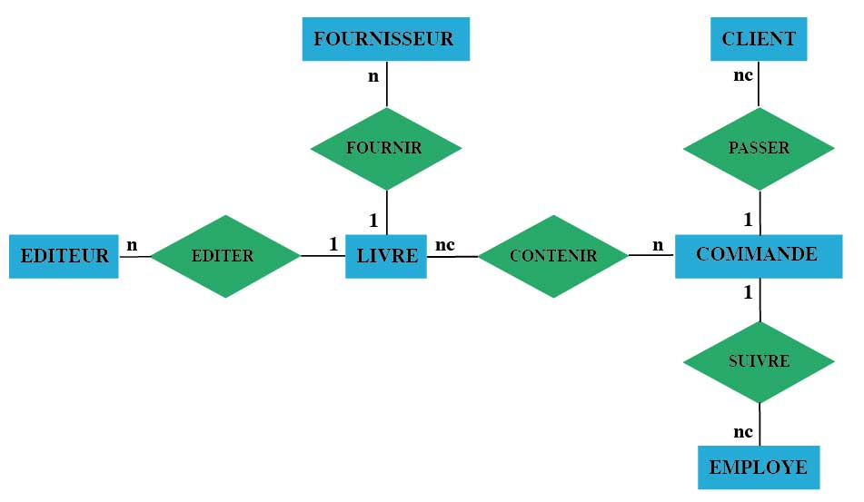

En plus de leurs clés d'identification, les entités du schéma
relationnel seront caractérisées par les attributs suivants:

*   Champs de l'entité ``Livre``

    -   ``Titre``, ``Auteur``, ``Catégorie``, ``ISBN``, ``Prix``, ``Quantité``

*   Champs de l'entité ``Editeur``

    -   ``Nom``, ``Adresse``, ``Ville``, ``Pays``, ``Email``, ``URL``

*   Champs de l'entité ``Fournisseur``

    -   ``Nom``, ``Adresse``, ``Ville``, ``Email``, ``Téléphone``

*   Champs de l'entité ``Commande``

    -   ``Date``

*   Champs de l'entité ``Client``

    -   ``Nom``, ``Genre``, ``Adresse``, ``Ville``, ``Pays``, ``Email``, ``Total des achats``
    
*   Champs de l'entité ``Employé``

    -   ``Nom``, ``Genre``, ``Adresse``, ``Ville``, ``Pays``, ``Email``, ``Role``

..  only:: corrige

    ..  admonition:: Solution

        ..  figure:: figures/rel16.jpg
            :align: center
            :width: 90%

        Notez que la table ``LIGNE_COMMANDE`` est une table associative permettant
        de faire la correspondance entre les entités ``LIVRE`` et ``COMMANDE``. Nous
        sommes partis de l'idée qu'une commande est composée d'une ou plusieurs
        lignes: chaque ligne correspond à un article commandé dans une commande
        donnée passée par un client donné. Ainsi, chaque ligne de commande
        désignera un livre commandé et la quantité commandée de ce livre. Par
        exemple, la commande ci-dessous comporte 3 lignes:

        ..  figure:: figures/rel17.jpg
            :align: center
            :width: 90%

        Les champs ``LivreID`` et ``CommandeID`` sont des clés étrangères à la
        table ``LIGNE_COMMANDE`` qui permettent de créer une association entre les
        commandes et les livres commandés. Le champs ``Quantité`` permet de
        préciser le nombre d'exemplaires commandé d'un ouvrage dans une ligne de
        commande. Finalement, remarquez que la clé primaire de la table
        ``LIGNE_COMMANDE`` est composée de la concaténation des clés étrangères
        présentes dans la table. Cette option permet d'éviter d'entrer plus
        d'une fois une ligne de commande identique.

Étape 3: La spécialisation
~~~~~~~~~~~~~~~~~~~~~~~~~~

Chaque ensemble d'entités dans une hiérarchie de spécification donne
lieu à une table distincte. La clé primaire de la table ascendante est
aussi celle des tables au niveau inférieur. Puisque le modèle
relationnel ne prévoit pas l'implémentation directe de la structure des
liens dans une hiérarchie de généralisation, nous devons exprimer de
manière indirecte les propriétés de cette hiérarchie. Par conséquent,
les clés d'identification des tables spécialisées doivent toujours
correspondre à celle de la table ascendante.

L'implémentation des ensembles disjoints nécessite l'introduction d'un
nouvel attribut ``Catégorie`` dans la table ascendante. Cet attribut
permet de réaliser une classification en indiquant l'ensemble spécialisé
correspondant à chaque catégorie. Dans une spécialisation de type
disjoint et complet, il faut également s'assurer que chaque occurrence
dans la table ascendante génère une occurrence correspondante dans une
des tables spécialisées et vice-versa. Ceci est possible en imposant une
contrainte de valeur non nulle à l'attribut ``Catégorie``.

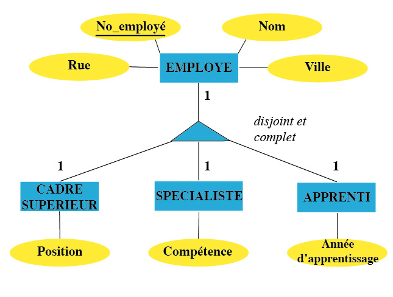

    Schéma d'une spécialisation

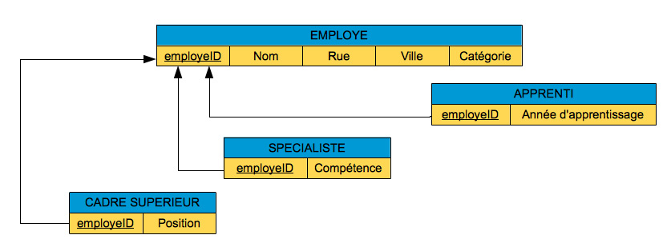

    Transformation de la spécialisation en tables

Dans l'exemple ci-dessus, les données concernant les employés forment
une hiérarchie de spécialisation qui nous amène à créer quatre tables
``EMPLOYE``, ``CADRE`` ``SUPERIEUR``, ``SPECIALISTE`` et ``APPRENTI``. Nous devons définir
la même clé d'identification ``employeID`` pour toutes les tables
subordonnées à la table ``EMPLOYE``. Sachant qu'un employé particulier ne
peut appartenir simultanément à plusieurs cartégories, nous introduisons
l'attribut ``Catégorie`` dont les valeurs sont «Cadre supérieur»,
«Spécialiste» et «Apprenti». Par cette méthode, nous garantissons la
propriété d'une hiérarchie de généralisation disjointe: l'intersection
des ensembles spécialisés est vide. La propriété de complétude ne peut
pas s'exprimer explicitement dans le modèle relationnel mais sera
implémentée, dans le modèle physique, sous la forme d'une contrainte
d'intégrité spéciale.

Étape 4: Les contraintes d'intégrités
~~~~~~~~~~~~~~~~~~~~~~~~~~~~~~~~~~~~~

Le concept d'**intégrité** signifie l'absence d'incohérence dans une
base de données. Les contraintes d'intégrité structurelles établissent
des règles qui viennent compléter le schéma relationnel de la base de
donnée pour assurer sa cohérence et seront par la suite traduites en ``SQL``
dans le système de gestion de base de données afin d'assurer la
cohérence de la base de données. Ajouter un enregistrement, supprimer un
enregistrement ou modifier la valeur d'attribut d'un enregistrement sont
des opérations qui ne sont autorisées par le ``SGBD`` que si les contraintes
d'intégrité structurelles sont toujours respectées par les données après
l'opération. Si les contraintes sont violées, nous dirons alors que les
données ont perdu leur intégrité.

Les contraintes d'intégrité sont classées en quatre catégories:

-  **Contrainte de domaines**

   Dans une table, un champ ne peut prendre que des valeurs appartenant
   à un domaine de valeurs prédéfinies. Comme nous le verrons par la
   suite, le langage ``SQL`` admet divers types de données pour la
   déclaration d'un champ de table, parmi lesquels nous retiendrons:

   -  ``INT``: entiers signés longs;
   -  ``DECIMAL(p, q)`` : nombres décimaux d'au moins ``p`` chiffres dont
      ``q`` après le point décimal;
   -  ``CHAR(p):`` chaîne de longueur fixe de ``p`` caractères;
   -  ``TEXT``: zone de texte standard;
   -  ``VARCHAR(p)`` : chaîne de longueur variable d'au plus ``p``
      caractères;
   -  ``DATE``: dates au format anglophone (années, mois et jour);
   -  ``DATETIME``: dates et heure au format anglophone (années, mois et jour, heure, minute seconde);

   Ce domaine de valeurs peut être rajouté à chaque attribut d'une table
   directement dans le schéma relationnel:

   .. comment sql

      EMPLOYE(
         employeID INT, Nom VARCHAR(20), Rue VARCHAR(30),
         Ville VARCHAR(20), AffectationID INT
      )

   .. raw:: html

      
EMPLOYE(employeID INT, Nom VARCHAR(20), Rue VARCHAR(30), Ville VARCHAR(20), AffectationID INT) 

-  **Contrainte de valeur non nulle**

   En travaillant avec une base de données, nous rencontrerons souvent
   des données dont les valeurs ne sont pas (ou pas encore) connues dans
   une table. Par exemple, un employé peut être inséré dans la table
   ``EMPLOYE`` sans qu'on connaisse son adresse complète. Dans pareils cas,
   il s'avère judicieux d'insérer des valeurs dites **nulles** au lieu
   de valeurs peu significatives voire fausses. Une valeur nulle est
   donc une **donnée de remplissage fictive** représentant une valeur de
   donnée qui n'est pas (ou pas encore) connue dans une colonne d'une
   table. Naturellement, les attributs d'une table ne doivent pas tous
   admettre des données de valeurs nulles, sinon des conflits surgiront
   inévitablement. Pour empêcher un attribut d'être mis à la valeur
   nulle, il faut lui appliquer une contrainte de valeur non nulle lors
   de la définition de la table. Cette contrainte est indispensable, par
   exemple, pour assurer le caractère complet d'une spécialisation ou
   pour préciser qu'une association est de type simple (1) et non
   conditionnel.

   Dans l'exemple suivant, la contrainte de valeur non nulle assure que
   chaque employé est affecté à un département:

   .. comment sql

      EMPLOYE(employeID, Nom, Rue, Ville, AffectationID NOT NULL)

   .. raw:: html

      
EMPLOYE(employeID, Nom, Rue, Ville, AffectationID NOT NULL) 

-  **Contrainte d'unicité**

   Chaque table de la base de données doit posséder une clé
   d'identification (un attribut ou une combinaison d'attributs) qui
   sert à différencier les enregistrements dans la table de manière
   unique. Lorsqu'il y a plusieurs clés candidates dans une même table,
   la contrainte d'unicité nous oblige à en déclarer une comme *clé
   primaire*. C'est le système de gestion de bases de données qui
   vérifie l'unicité des valeurs d'une clé primaire.

   La contrainte d'unicité est représentée dans le schéma relationnel
   par un soulignement de l'attribut (ou de la combinaison d'attributs)
   jouant le rôle de clé primaire:

   .. comment sql

      EMPLOYE(employeID, Nom, Rue, Ville, AffectationID)

   .. raw:: html

      
EMPLOYE(employeID, Nom, Rue, Ville, AffectationID) 

-  **Contrainte d'intégrité référentielle**

   Chaque valeur d'une clé étrangère doit exister comme valeur de la clé
   d'identification correspondante dans la table référencée.

   Cette contrainte est traduite dans le schéma relationnelle en
   indiquant l'attribut lié à la clé étrangère dans la table étrangère:

   .. comment sql

      EMPLOYE(employeID, Nom, Rue, Ville, AffectationID)
             FOREIGN KEY (AffectationID) REFERENCES DEPARTEMENT (departementID)

   .. raw:: html

      
EMPLOYE(employeID, Nom, Rue, Ville, AffectationID) 
               &nbsp; &nbsp; &nbsp; FOREIGN KEY (AffectationID) REFERENCES DEPARTEMENT (departementID)  
               

Dans notre exemple, la table ``DEPARTEMENT`` admet le numéro de département
``departementID`` comme clé primaire. Celle-ci est utilisée dans la
table ``EMPLOYE`` comme clé étrangère associée à l'attribut
``AffectationID`` qui détermine le département auquel un employé est
affecté. Le lien entre les clés primaire et secondaire respecte la
contrainte d'intégrité référentielle si, dans la table ``EMPLOYE``, tous les
numéros de département de la clé étrangère existent comme valeurs de la
clé primaire dans la table ``DEPARTEMENT``:

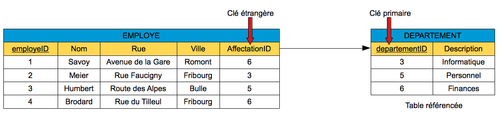

    Garantie de l'intégrité référentielle

La garantie de l'intégrité référentielle déclenche des actions
spécifiques lors de la suppression d'un enregistrement provenant d'une
table et référencé par d'autres enregistrements dans une table
étrangère. Le système de gestion de base de données peut alors se
comporter de plusieurs manières:

-  **Suppression restreinte**

   Avec la suppression restreinte, l'opération ne sera pas exécutée tant
   que l'enregistrement à supprimer est référencé par un enregistrement
   dans une autre table. Par exemple, si nous voulons détruire
   l'enregistrement «6, Finances» dans la table ``DEPARTEMENT``, notre
   opération sera refusée en vertu de la règle de suppression restreinte
   car deux employés (Savoy et Brodard) travaillent dans ce département.

-  **Suppression en cascade**

   Avec la suppression en cascade, la suppression d'un enregistrement
   entraîne celle de tous les enregistrements dépendants. Par exemple,
   si nous demandons la suppression en cascade de l'enregistrement «6,
   Finances» de la table ``DEPARTEMENT``, notre opération entraînera la
   destruction simultanée des enregistrements «Savoy» et «Brodard» dans
   la table ``EMPLOYE``.

-  **Suppression avec mise à la valeur nulle**

   Une suppression avec mise à la valeur nulle signifie que les valeurs
   d'une clé étrangère deviennent nulles lors de la suppression des
   enregistrements référencés. Par exemple, si nous supprimons
   l'enregistrement «6, Finances» de la table ``DEPARTEMENT`` en appliquant
   cette règle d'intégrité, les valeurs de la clé étrangère
   ``AffectationID`` située dans la table ``EMPLOYE`` deviendront nulles
   pour les employés Savoy et Brodard.

Notons finalement que les opérations d'insertion et de mise à jour
peuvent également être soumises à des contraintes qui garantissent en
permanence l'intégrité reéférentielle d'une base de données. Par
exemple, l'insertion du tuple «20, Morel, Chemin du Cerisier, Marly, 7»
sera rejetée par un système de gestion de base de données qui supporte
l'intégrité référentielle. En effet, la valeur «7» sera déclarée
invalide car elle n'existe pas dans la table référencée ``DEPARTEMENT``.

Exercice (étapes 3 et 4)
~~~~~~~~

En vous basant sur le schéma entités-associations ci-dessous
représentant la structure des données nécessaires à la gestion d'une
chaîne d'hôtels, créez le schéma logique de la base de données
relationnelle associée. A ce dessein, vous utiliserez la notation
condensée présentée ci-dessus en indiquant toutes les contraintes
d'intégrité à l'exception de la contrainte de domaine.

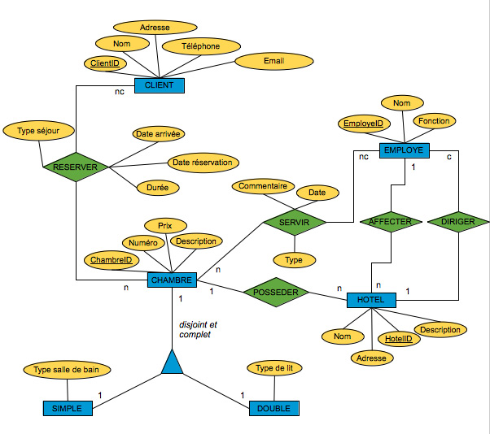

..  only:: corrige

    ..  admonition:: Solution

        ..  figure:: figures/rel19.jpg
            :align: center
            :width: 90%

