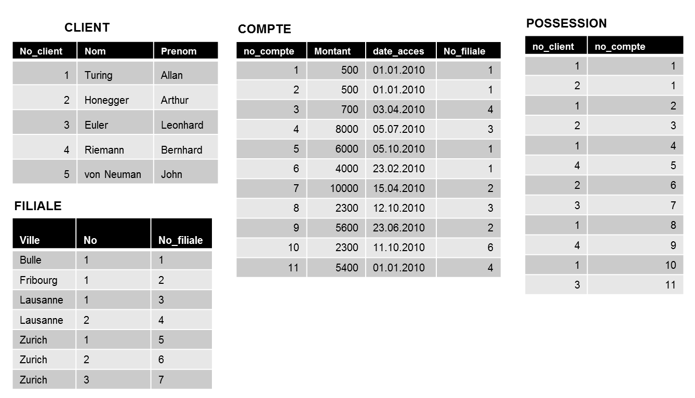

#############################
Modèle relationnel : exercer les notions de base
#############################

..  only:: prof

    Aspects didactiques et remarques pour l'enseignant
    =================================================

    ..  admonition:: @prof Aspects didactiques

        Les retours ont été posifis sur cet exercice. Les étudiants ont pu le
        faire sans problème uniquement à l'aide de la vidéo. Ils ont donc pu
        saisir les notions essentielles du modèle relationnel.

    ..  admonition:: @prof Améliorations

        Pour l'exerice 1, les données présentes dans cet exercice à faire de
        manière théorique ne correspondent pas aux données présentes dans les
        fichiers CSV trouvés dans le cours de CHAJ, essentiellement car il a
        corrigé des imperfections qui restaient dans ma première version.

        *   Modifier les fichiers CSV tout en gardant les corrections
            principales pour que les réponses concordent

        *   Je ne vois malheureusement pas à quoi cette remarque fait référence ...
            dommage ...
            

Exercice 1
==========

Vous êtes architecte de données dans une banque suisse qui demande d'analyser
le schéma relationnel suivant concernant la gestion de leurs clients et de
leurs comptes en banques.

Contexte
--------

* La banque dispose de différentes filiales réparties dans les villes suisses.

* Il est possible qu'une même ville compte plusieurs filiales.

* Chaque client possède un ou plusieurs comptes qui sont inscrits chez une
  filiale particulière.

Données stockées dans la base de données
----------------------------------------

Voici un extrait de la base de données de la banque :

    Données de la base de données

..  _ref-relational-model-exo-1-consignes:

Consignes
---------

Répondez aux questions suivantes :

#)  Quel est le but de la table ``POSSESSION`` ?

    ..  only:: corrige and not latex

        ..  admonition:: Corrigé

            Cette table crée un lien entre la table ``CLIENT`` et la table
            ``COMPTE``. La première ligne de cette table associe par exemple le
            client Alan Turing au compte numéro 1.

#)  Quels sont les comptes possédés par Arthur Honegger? Indiquez leur numéro.

    ..  only:: corrige and not latex

        ..  admonition:: Corrigé

            En observant la table ``POSSESSION``, on voit que Arthur Honegger
            possède les comptes 1, 3 et 6

#)  Quel est le montant de la fortune de Euler?

    ..  only:: corrige and not latex

        ..  admonition:: Corrigé

            * Le numéro de client de Euler est 3

            * les comptes possédés par le client 3 (Euler) sont les comptes 7
              et 11 (table ``POSSESSION``)

            * Le compte 7 contient 10000 CHF et le compte 11 contient 5'400.
              De ce fait, Euler possède :math:`10'000 + 5'400 = 15'400` CHF.

#)  Quel est le client qui a accédé en dernier à son compte?

    ..  only:: corrige and not latex

        ..  admonition:: Corrigé

            * On voit dans la table ``COMPTE`` que le dernier compte a été
              accédé le 12.10.2010.

            * Il s'agit du compte numéro 8 qui appartient au client 1 d'après
              la table ``POSSESSION``

            * Le client dont ``no_client`` vaut 1 est **Alan Turing**.

#)  Quelle est la filiale qui gère le plus d’argent?

    ..  only:: corrige and not latex

        ..  admonition:: Corrigé

            C'est la filiale 2 avec un montant géré de 15'600 CHF

        Preuve
        ~~~~~~

        ..  csv-table:: Comptes gérés par chaque filiale avec leur montant
            :header: "no_filiale", "Compte géré", "Montant"

            "1", "1", "500"
            "1", "2", "500"
            "1", "5", "6000"
            "1", "6", "4000"
            "2", "7", "10'000"
            "2", "9", "5'600"
            "3", "4", "8000"
            "3", "8", "2300"
            "4", "3", "700"
            "4", "11", "5400"
            "6", "10", "2300"

        ..  admonition:: Remarque

            Les filiales 5 et 7 ne gèrent aucun compte

        ..  csv-table:: Montant géré par chaque filiale
            :header: "no_filiale", "Montant total"

            "1", "11'000"
            "2", "15'600"
            "3", "10'300"
            "4", "6'100"
            "5", "0"
            "6", "2300"
            "7", "0"

#)  Y a-t-il un compte possédé par plusieurs clients? Si oui, par qui ?

    ..  only:: corrige and not latex

        ..  admonition:: Corrigé

            * On voit dans les deux premières lignes de la table
              ``POSSESSION`` que le compte numéro 1 est possédé par les
              clients 1 et 2, à savoir Turing et Honegger.

..  _ref-relational-model-exo-2:

Exercice 2
==========

Vous devez établir le schéma relationel de la base de données de l'exercice 1.
Plus précisément, il faut

#)  Pour chaque table, déterminer les champs qui forment la clé primaire et
    souligner ceux-ci dans le schéma.

    ..  only:: corrige

        .. admonition:: Corrigé

            Toutes les tables doivent avoir une clé primaire permettant
            d'identifier de manière unique et non ambigüe chaque
            enregistrement de la table.

            ..  csv-table:: Tables et leur clé primaire
                :header: "Table", "Clé primaire"

                "``CLIENT``", "``CLIENT.no_client``"
                "``COMPTE``", "``COMPTE.no_compte``"
                "``POSSESSION``", "``(no_client, no_compte)``"
                "``FILIALE``", "``no_filiale``"

            **Remarque** : La clé primaire de la table ``POSSESSION`` est une clé
            composée : ni l'un ni l'autre des champs peut servir à lui seul de
            clé primaire, car certains comptes reviennent plusieurs fois dans
            la table, de même que plusieurs clients. C'est donc uniquement une
            combinaison des deux champs qui peut faire office de clé primaire.

#)  Déterminer les clés étrangères présentes dans chacune des tables et les
    entourer

    ..  only:: corrige

        ..  admonition:: Corrigé

            Il n'est pas obligatoire pour une table de contenir des clés
            étrangères. Les clés étrangères servent à faire référence à
            d'autre table pour les mettre en relation.

            ..  csv-table:: Tables et leur clé étrangères
                :header: "Table", "Clé étangère"
                :align: center

                "``CLIENT``", "Ne possède pas de clé étrangère"
                "``COMPTE``", "``no_filiale`` fait référence au champ ``no_filiale`` de la table ``FILIALE``
                "``POSSESSION``", "``no_client`` fait référence au champ ``CLIENT.no_client``
                "``POSSESSION``", "``no_compte`` fait référence au champ ``COMPTE.no_compte``
                "``FILIALE``", "Ne possède pas de clé étrangère"

#)  Établir les liens entre les différentes tables.

    ..  admonition:: Indication

        Un lien part d'une clé étrangère et pointe vers la clé primaire d'une
        autre table.

    ..  only:: corrige

        ..  admonition:: Corrigé

            ..  figure:: figures/corrige_exo_2.png
                :scale: 70%
                :align: center

                Schéma relationnel complété pour l'exercice :ref:`ref-relational-model-exo-2`

..  only:: not corrige

    Schéma de base
    --------------

    Le schéma relationnel ne mentionne pas toutes les données présentes dans les
    tables, mais uniquement les noms des champs de ces tables :

    ..  figure:: figures/schema-relationnel-banque-acompleter-sanstypes.png
        :width: 80%
        :align: center

        Schéma relationnel à compléter

