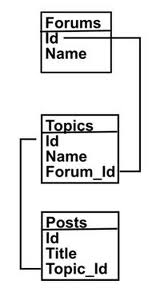
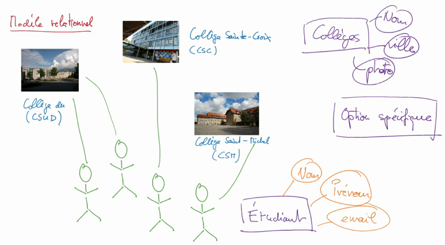
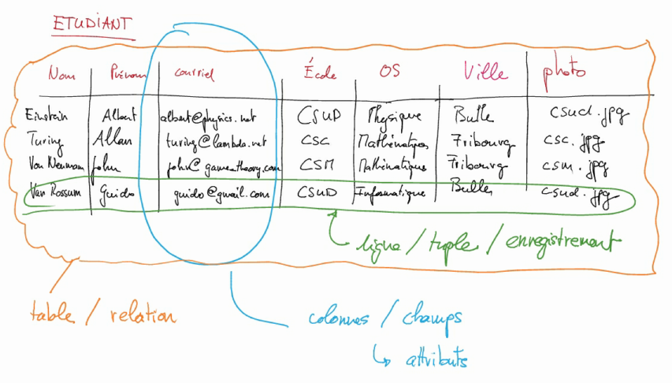
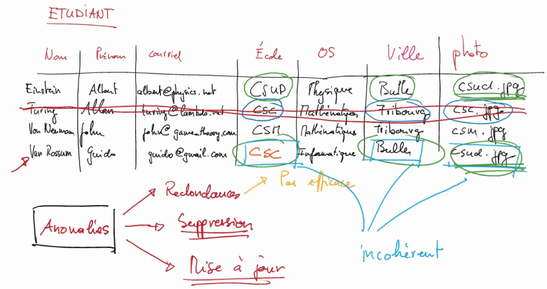
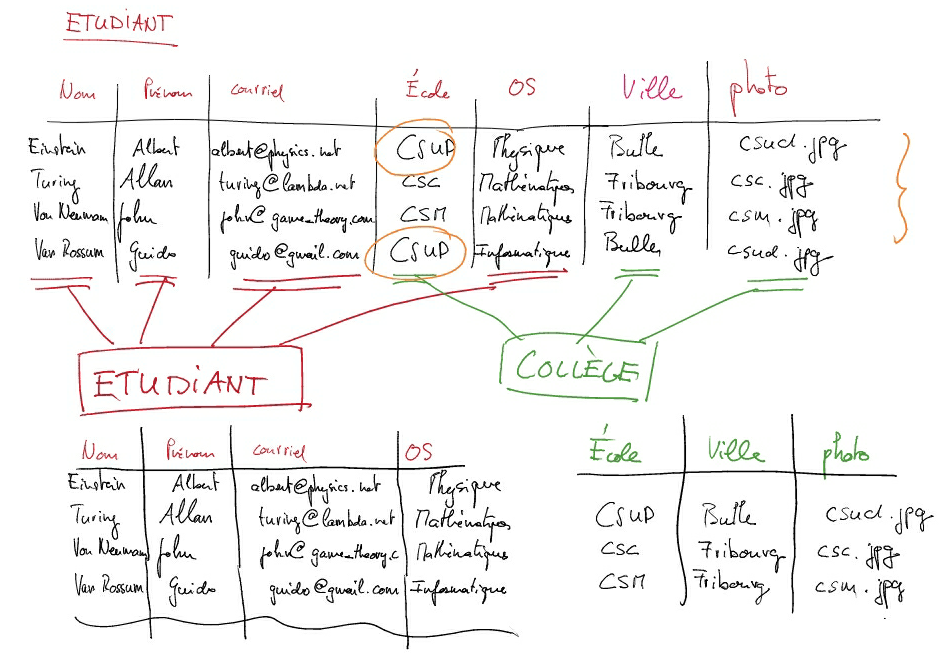
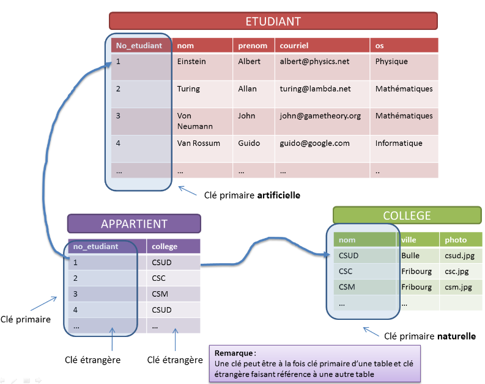
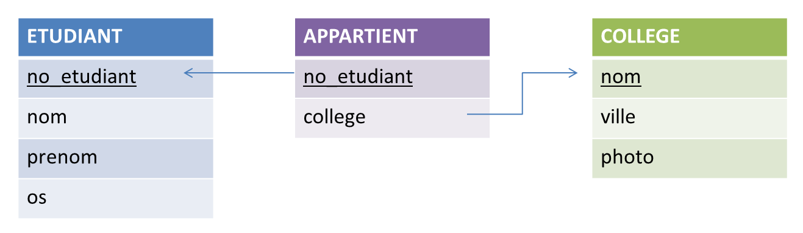

##################################
Introduction au modèle relationnel
##################################

..	only:: prof
	
	Remarques didactiques
	=====================

	..	admonition:: @prof : Utilisation de cette partie

		Les étudiants sont sensés acquérir seuls les notions essentielles
		concernant le modèle relationnel à l'aide de cette section qui
		contient

		* une vidéo présentant la modélisation d'un cas simple

		* présentation des anomalies qui peuvent se produire dans un modèle
		  relationnel

		* Élimination de ces anomalies à l'aide de plusieurs tables

		La section suivante permet de vérifier l'acquisition de ces concepts à
		l'aide d'un cas similaire légèrement plus complexe.

..	only:: prof

	Présentation en cours
	=====================

	..	admonition:: @prof : Utilisation de cette partie

		* éclaircir les notions suivantes en cours, qui font défaut dans la vidéo :

			* Valeurs NULL : quelle est l'utilité + conséquences pour les clés
			  étrangères

			* clés primaires ou étrangères composées

			* Atomicité des champs : on peut peut pas stocker des listes dans les colonnes d'une table dans le modèle relationnel. Soulever que dans d'autres types de BD, c'est possible (Exemple Google Big Table).
			

Brève présentation
==================

Le modèle relationnel permet de structurer de grandes quantités de données de
manière cohérente. La plupart des bases de données qui gèrent les énormes
quantités de données du Web sont des bases de données utilisant ce modèle
relationnel. Historiquement, c'est le premier modèle de données qui a permis
d'organiser de manière cohérente et efficace les quantités de données si
énormes qui sont générées chaque jour dans notre société de l'information.

C'est certainement l'invention des bases de données relationnelles qui ont
permis le phénoménal développement de notre société de l'information.

	Un exemple de modèle relationnel pour la gestion d'un forum

Vidéo d'introduction
====================

Voici une petite vidéo introductive qu'il faut impérativement regarder avant
le premier cours d'OCI. Elle présente les bases essentielles à connaître à
propos du modèle relationnel

..	only:: html

	..	youtube:: OkSUhf_O6wA

..	only:: not html

	..	admonition:: Lien de la vidéo

		* http://www.youtube.com/watch?v=OkSUhf_O6wA

Résumé
======

Présentation de la situation à modéliser
----------------------------------------

Voici la situation que nous modélisons dans le modèle relationnel. C'est un
exemple tout simple, mais il est fondamental de bien comprendre la démarche
expliquée dans la vidéo permettant d'obtenir le schéma relationnel final
montré dans la figure :ref:`relational-model-schema-trois-tables`

	Présentation de la situation à modéliser

Vocabulaire du modèle relationnel
---------------------------------

Voici quelques notions qu'il est essentiel de connaitre dans le modèle relationel

* table / relation
* ligne / tuple / enregistrement
* colonne / champ / attribut

Elles sont présentées dans la table ci-dessous :

	Stockage dans une seule table

Anomalies présentes dans le premier jet de notre table
------------------------------------------------------

Lorsqu'on modélise les données directement dans le modèle relationnel et si
l'on ne réfléchit pas trop, il peut arriver que les données soient mal
structurées comme dans la table de la figure :ref:`relation-model-anomalies`.

..	_relation-model-anomalies:

	Anomalies présentes dans cette table

Séparation en plusieurs tables pour éviter les anomalies
--------------------------------------------------------

Pour éviter ces anomalies, on peut séparer notre table en plusieurs tables  en
regroupant les données qui concernent les étudants et celles concernant les
collèges dans des tables différentes.

	Transformation du modèle en plusieurs tables

..
	..	figure:: figures/resume-5.png
		:align: center
		:width: 100%

	
Schéma correct sans les anomalies
---------------------------------

Voici ce que donne notre modèle lorsque nous le séparons en plusieurs tables.
Ces tables ne présentent plus (trop) de redondances, sont exemptes d'analies
de suppresion et de mise à jour.

	Schéma relationnel exempt des anomalies citées

Schéma des tables dans le modèle relationnel
--------------------------------------------

En général, on ne donne pas tout le contenu des tables, mais uniquement la
description des colonnes qui la composent ainsi que les liens qui existent entre les tables, comme dans l'exemple suivant :

..	_relational-model-schema-trois-tables:

	Schéma relationnel avec la description des tables