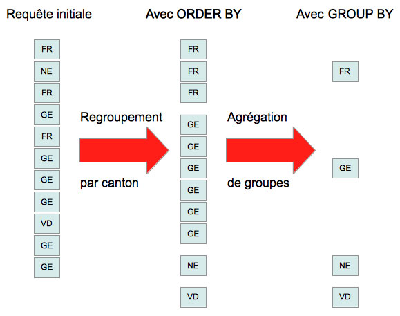

###################################
Interrogation de la base de données, notions avancées de l'instruction ``SELECT``
###################################

..  sql-connection-config:: sqlite:///library.db

..  todo::

    Partager cette partie en plusieurs sous-parties plus gérables et mettre
    pour chaque partie les exercices qui lui correspondent

    *   Tri

    *   Fonctions d'aggrégations

    *   ``GROUP BY``

    *   ``HAVING``

..  todo::

    Faire une vidéo de présentation de chaque aspect avancé de ``SELECT`` (pas
    prioritaire pour cette année), car déjà présenté en cours et la théorie
    est déjà bien écrite.

..  admonition:: Référence utile

    Les documents suivants peuvent être utiles comme référence du langage SQL
    tout en sachant que toutes les instructions présentées ne pourront pas
    forcément être exécutées dans le dialecte SQL compris par le SGBDR que
    vous utilisez.

    *

Syntaxe générale
================

Comme en témoigne la page de documentation de l'instruction ``SELECT``, celle-
ci est passablement riche et compliquée à maîtriser.

Dans le cadre de ce cours, il vous sera demandé de maîtriser les éléments
mentionnés dans la syntaxe suivante :

::

    SELECT
        [ALL | DISTINCT]
        -- Colonnes sur lesquelles on projète le résultat
        <liste de colonnes>
    FROM
        -- Produit cartésien des tables mentionnées
        <liste de tables>
    [WHERE <conditions>] --(Sélection)
    [GROUP BY <liste de colonnes>]
    [ORDER BY <liste de colonnes> [ASC|DESC]]
    [HAVING <conditions avec fonctions d'aggrégation>]

Explication de cette syntaxe
----------------------------

La syntaxe ci-dessus place entre crochets les éléments facultatifs. Ceci est
une notation courante en informatique.

Cette notation est discutable pour le SQL car les crochets ``[]`` font partie
de la syntaxe du SQL.

Jointures de tables
===================

..  admonition:: Référence
    :class: danger

    On trouve une excellente explication des jointures de tables sous http://sql.sh/cours/jointures

..  sql-connection-config:: sqlite:///bank.db

Pour le moment, nous avons vu comment effectuer des jointures de tables en sélectionnant certaines lignes du produit cartésien :

..  sql::

    SELECT *
    FROM
        client, possession
    WHERE
        client.no_client = possession.no_client

Il existe cependant des syntaxes plus naturelles pour exrimer ces jointures

..  sql::

    SELECT
        client.prenom AS [Prénom],
        client.nom AS [Nom],
        possession.no_compte AS [No compte]
    FROM
        client
    NATURAL JOIN possession

..  sql-connection-config:: sqlite:///library.db

Mots-clés ``ALL`` et ``DISTINCT``
=================================

Ces mots-clés, placés directement après le mot ``SELECT`` indiquent s'il faut
ou non garder les lignes identiques dans le résultat final.

*   ``DISTINCT`` élimine les doublons
*   ``ALL`` garde tous les résultats (comportement par défaut)

Exemple
-------

..  butreq::

    Déterminer le nombre exact de villes distinctes de Suisse dans lesquelles séjournent
    au moins une librairie cliente de la base de données.

..  sql::

    SELECT DISTINCT
        ville AS [Villes présentes dans la table client]
    FROM
        client

Tri des résultats : clause ``ORDER BY``
==================================

Tri selon une seule colonne
---------------------------

Tri croissant (``ASC``)
~~~~~~~~~~~~~~~~~~~

..  butreq::

    Afficher les clients fribourgeois, triés dans l'ordre croissant (*ascending*) de ``client.nom``

..  sql::

    SELECT *
    FROM client
    WHERE client.canton = 'FR'
    ORDER BY client.nom ASC

..  admonition:: Remarque

    Le mot-clé ``ASC`` n'est pas nécessaire pour trier dans l'ordre croissant,
    car il s'agit du comportement par défaut.

Tri décroissant (``DESC``)
~~~~~~~~~~~~~~~~~~~~~~~~~~~

..  butreq::

    Afficher les clients fribourgeois, triés dans l'ordre décroissant (*descending*) de ``client.nom``

..  sql::

    SELECT *
    FROM client
    WHERE client.canton = 'FR'
    ORDER BY client.nom DESC

Tri selon plusieurs colonnes
----------------------------

..  butreq::

    Afficher l'ensemble des clients, triés selon ``client.canton`` premièrement
    et ensuite d'après ``client.nom``.

..  sql::

    SELECT *
    FROM client
    ORDER BY client.canton, client.nom

Clause ``GROUP BY`` et fonctions d'aggrégation
==============================================

L'aggrégation permet de regrouper certaines lignes du résultat sur la base de
la valeur contenue dans une colonne.

Il est par exemple possible de regrouper tous les clients par cantons

..  sql::

    SELECT client.canton
    FROM client
    GROUP BY client.canton

La figure :ref:`fig-select-client-group-by` explique le fonctionnement de
l'aggrégation.

..  _fig-select-client-group-by:

    Illustration du fonctionnement de l'aggrégation

Fonctions d'aggrégation
=======================

Les fonctions d'aggrégation vont prendre toutes les lignes du résultat de la
requête et effectuer une aggrégation sur une de ses colonnes. Par exemple, il
est possible de prendre tous les prix unitaires de la table ``produit`` et
d'en faire la somme

..  sql::

    SELECT
        SUM(produit.prix_unitaire) AS [Somme des prix de tous les produits]
    FROM
        produit

Fonctions d'aggrégation à connaître (*Aggregation functions*)
=============================================================

..  admonition:: Exemples de fonctions d'aggrégation

    ..  list-table::
        :header-rows: 1

        *   - Fonction
            - Effet

        *   - ``SUM(col)``
            - Retourne la somme de tous les champs de la colonne ``col`` regroupés dans un même aggrégat

        *   - ``AVG(col)``
            - Retourne la moyenne de tous les champs de la colonne ``col`` regroupés dans un même aggrégat

        *   - ``COUNT(col)``
            - Retourne le nombre de lignes faisant partie d'un même aggrégat

        *   - ``MAX(col)``
            - Retourne la valeur maximale de tous les champs de la colonne ``col`` regroupés dans un même aggrégat

        *   - ``MIN(col)``
            - Retourne la valeur minimale de tous les champs de la colonne ``col`` regroupés dans un même aggrégat

..  admonition:: Information

    Vous trouverez les fonctions d'aggrégation supportées par SQLite dans la
    documentation sous http://www.sqlite.org/lang_aggfunc.html

Exemples
--------

#)  ..  butreq::

        Compter le nombre de lignes dans la table ``client``

    ..  sql::

        SELECT
            COUNT(*) AS [Nombre de clients]
        FROM
            client

#)  ..  butreq::

        Regrouper les clients par canton. Ceci est une façon d'énumérer les cantons
        présents dans la table ``client``.

    ..  sql::

        SELECT
            client.canton AS [Canton]
        FROM
            client
        GROUP BY (client.canton)

#)  ..  butreq::

        Pour chaque canton présent dans la table ``client``, compter le
        nombre de clients différents habitant dans ce canton.

    ..  sql::

        SELECT
            client.canton AS [Canton],
            COUNT(client.client_id) AS [Nombre de clients]
        FROM
            client
        GROUP BY (client.canton)

    La figure :ref:`select-client-group-by-countbycanton` explique le fonctionnement de
    l'aggrégation.

    ..  _select-client-group-by-countbycanton:

    ..  figure:: figures/select-client-group-by-countbycanton.jpg
        :width: 65%
        :align: center

        Fonctionnement de la fonction d'aggrégation ``COUNT(col)``

Aggrégation et Clause ``HAVING``
================================

La clause ``HAVING`` permet de spécifier des conditions de sélection faisant
intervenir des fonctions d'aggrégation. En somme, la clause ``HAVING``
s'utilise conjointement avec la clause ``GROUP BY`` pour filtrer les lignes
d'une requête impliquant un ``GROUP BY`` et des fonctions d'aggrégation.

Exemple
-------

#)  ..  butreq::

        On reprend le dernier exemple de la section précédente, mais on n'affiche
        que les cantons romands qui ont plus d'un client.

    ..  sql::

        SELECT
            client.canton AS [Canton],
            COUNT(*) AS 'Nombre de clients'
        FROM
            client
        WHERE client.canton IN ('VS', 'FR', 'VD', 'GE', 'NE', 'JU')
        GROUP BY
            client.canton
        HAVING
            COUNT(*) > 1

Sous-requêtes
=============

Il est parfois nécessaire ou du moins très utile d'effectuer des requêtes
``SELECT`` intermédiaires à l'intérieur d'une requête ``SELECT`` pour
simplifier des requêtes qui seraient sinon très difficiles à exprimer avec des
jointures de tables.

Où peut-on placer des sous-requêtes SELECT ?
--------------------------------------------

*   On peut utiliser une sous-requêtes ``SELECT`` qui renvoie une table
    partout où  l'on spécifierait d'ordinaire le nom d'une table.

*   On peut utiliser une sous-requête ``SELECT`` qui renvoie une unique valeur
    partout où l'on s'attend d'ordinaire à avoir une valeur.

Les exemples ci-dessous devraient vous convaincre de l'utilité et de la
puissance de cette technique.

Exemples
--------

#)  ..  butreq::

        Déterminer le nom du client qui a placé la commande No. 1008 ?

        Pour parvenir à ce résultat, il faut d'abord trouver le ``client_id`` du
        client qui a placé la commande ``1008`` à l'aide de la requête SQL

        ..  sql::

            SELECT commande.client_id from commande WHERE commande.commande_id = 1008

        et ensuite, à partir de l'unique valeur ``12`` renvoyée dans le
        résultat par cette requête, exécuter la requête

        ..  sql::

            SELECT client.nom FROM client WHERE client.client_id = 12

    Voici la requête complète (avec sous-requête ``SELECT`` dans la clause ``WHERE``) :

    ..  sql::

        SELECT
            client.nom
        FROM
            client
        WHERE
            client.client_id = (
                SELECT commande.client_id
                FROM commande
                WHERE commande.commande_id = 1008
            )

Remarque
--------

Il est souvent possible de s'en sortir sans utiliser de requête imbriquée.
L'exemple suivant renvoie les mêmes données que la requête précédente, mais
sans recourir à une sous-requête :

..  butreq::

    Alternative à la requête précédente sans la requête imbriquée

..  sql::

    SELECT
        client.nom
    FROM
        client, commande
    WHERE
        commande.client_id = client.client_id
        AND commande.commande_id = 1008
